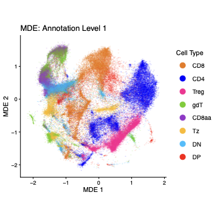
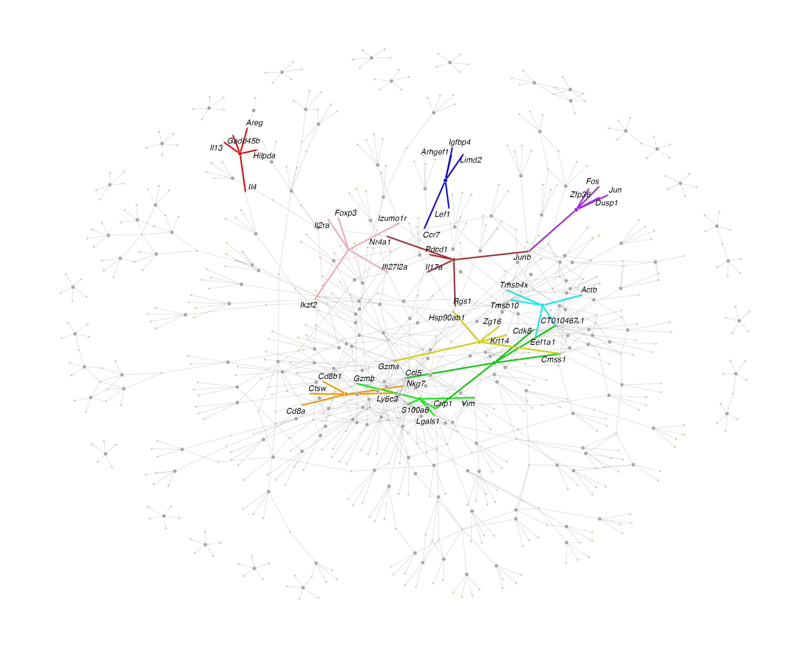
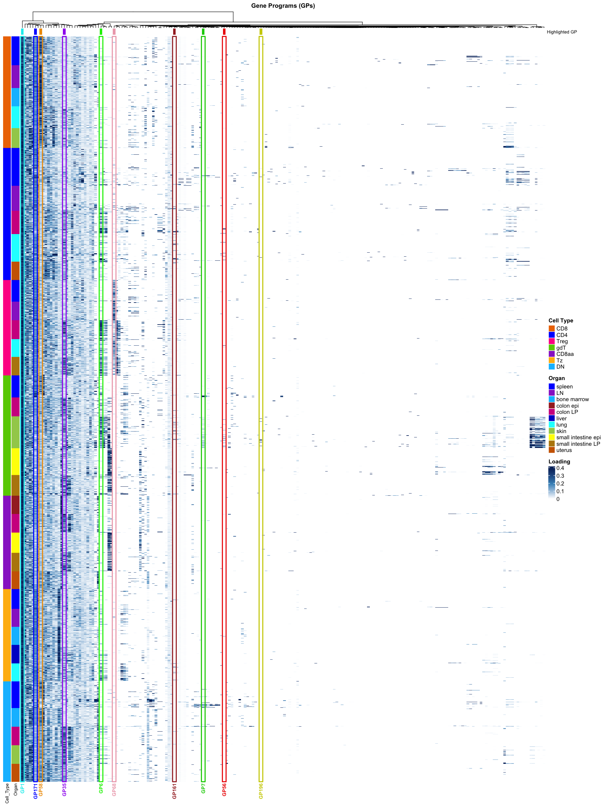
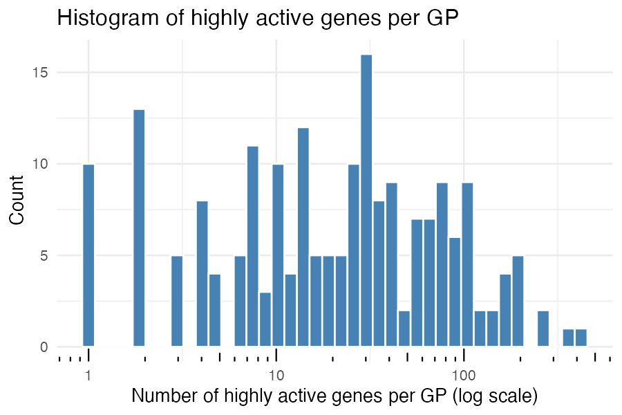
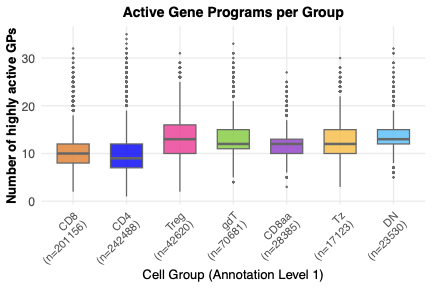
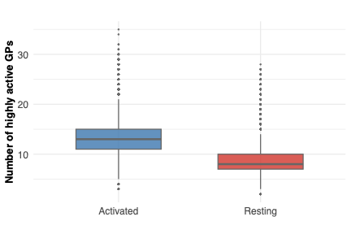
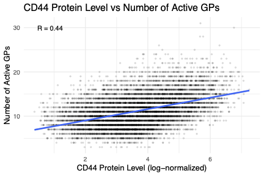

All panels except (B) are produced by
[`script/Figure1.R`](https://github.com/AgueroZZ/immgenT-GP-analysis/blob/main/script/Figure1.R).
The code below is shown for reference (not re-executed on this page, since
some steps such as the panel-C heatmap are slow); the images are its
pre-rendered output.

## Setup

Data loading, shared across all panels below.

```{r fig1-setup1, code=readLines("../script/Figure1.R")[42:68], eval=FALSE}
```

Panels E-I additionally restrict to non-thymocyte cells:

```{r fig1-setup2, code=readLines("../script/Figure1.R")[102:107], eval=FALSE}
```

## (A) Global MDE by lineage {#fig1a}

```{r fig1a-code, code=readLines("../script/Figure1.R")[70:98], eval=FALSE}
```

```{r fig1a-img, echo=FALSE, out.width="50%"}

```

::: {.figcaption}
**Fig. 1A.** Global MDE embedding of all non-thymocyte cells, colored by major lineage (cells subsampled per lineage for visualization).
:::

## (B) Study design schematic {#fig1b}

This panel is a hand-drawn schematic, not generated from R -- there is no code or pre-rendered image to show here. See `figures/final-selected/bits/Figure 1/1B.pdf` for the published panel.

## (C) Gene-program network {#fig1c}

```{r fig1c-code, code=readLines("../script/Figure1.R")[109:178], eval=FALSE}
```

```{r fig1c-img, echo=FALSE, out.width="70%"}

```

::: {.figcaption}
**Fig. 1C. Gene-program (GP) network.** A map of the 200 GPs and the signature
genes they share. Each GP's loadings are first normalized within the GP (divided
by that GP's maximum absolute loading, so loadings run 0–1), and every GP is
connected to its **top 5 up-regulated signature genes** (largest positive
normalized loadings, ≥ 0.1). **Grey balls are GPs** and **tan balls are genes**;
an edge joins a GP to each of its top signature genes, so a gene that appears
among several GPs' top genes links those GPs, and a force-directed layout places
programs with overlapping signatures near one another. A selected set of GPs is
**highlighted**, each in its own color carried along its edges to its (labeled)
top signature genes: GP68 (pink), GP58 (orange), GP35 (purple), GP171 (blue),
GP1 (cyan), GP56 (red), GP161 (dark red), GP6 (light green), GP7 (green),
GP196 (yellow). This shows each highlighted program's signature and how programs
that share genes sit together — e.g. the Treg program GP68 (*Foxp3, Il2ra,
Izumo1r*) and the CD8 program GP58 (*Cd8a, Cd8b1*) occupy distinct neighborhoods.
An internal version with a color→GP legend and GP-index labels is kept in
`experiments/gene_correlation_network/` (`gp_highlight_internal`).
:::

## (D) GP1 signature volcano {#fig1d}

```{r fig1d-code, code=readLines("../script/Figure1.R")[279:285], eval=FALSE}
```

```{r fig1d-img, echo=FALSE, out.width="50%"}

```

::: {.figcaption}
**Fig. 1D.** "Signature volcano" plot for one example GP (GP1): each gene's normalized score (x-axis, max |score| = 1) versus its mean shifted-log expression (y-axis), with the top-scoring genes labeled.
:::

## (E) Active-cell proportion per GP {#fig1e}

```{r fig1e-code, code=readLines("../script/Figure1.R")[189:204], eval=FALSE}
```

```{r fig1e-img, echo=FALSE, out.width="50%"}

```

::: {.figcaption}
**Fig. 1E.** Histogram of the proportion of cells with high loading (> 0.1) per GP, across all 200 GPs (x-axis on log scale).
:::

## (F) Active-gene count per GP {#fig1f}

```{r fig1f-code, code=readLines("../script/Figure1.R")[259:268], eval=FALSE}
```

```{r fig1f-img, echo=FALSE, out.width="50%"}

```

::: {.figcaption}
**Fig. 1F.** Histogram of the number of highly-active genes (|score| > 0.25 of that GP's max) per GP (x-axis on log scale).
:::

## (G) Active-GP count by lineage {#fig1g}

```{r fig1g-code, code=readLines("../script/Figure1.R")[224:243], eval=FALSE}
```

```{r fig1g-img, echo=FALSE, out.width="50%"}

```

::: {.figcaption}
**Fig. 1G.** Boxplot of the number of active GPs (loading > 0.1) per cell, grouped by major lineage.
:::

## (H) Active-GP count, activated vs. resting {#fig1h}

```{r fig1h-code, code=readLines("../script/Figure1.R")[206:222], eval=FALSE}
```

```{r fig1h-img, echo=FALSE, out.width="50%"}

```

::: {.figcaption}
**Fig. 1H.** Boxplot of the number of active GPs per cell, comparing activated versus resting cells.
:::

## (I) CD44 vs. active-GP count {#fig1i}

```{r fig1i-code, code=readLines("../script/Figure1.R")[245:257], eval=FALSE}
```

```{r fig1i-img, echo=FALSE, out.width="50%"}

```

::: {.figcaption}
**Fig. 1I.** Scatter plot of CD44 surface-protein level (log-normalized) against the number of active GPs per cell.
:::
