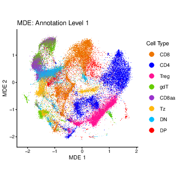
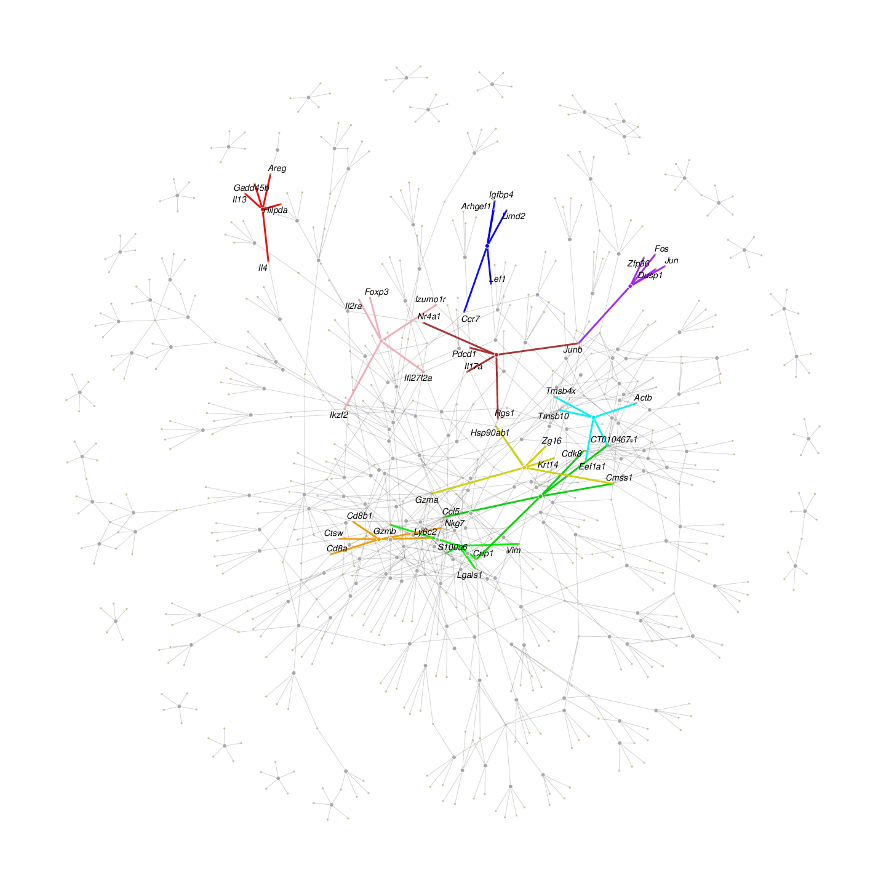
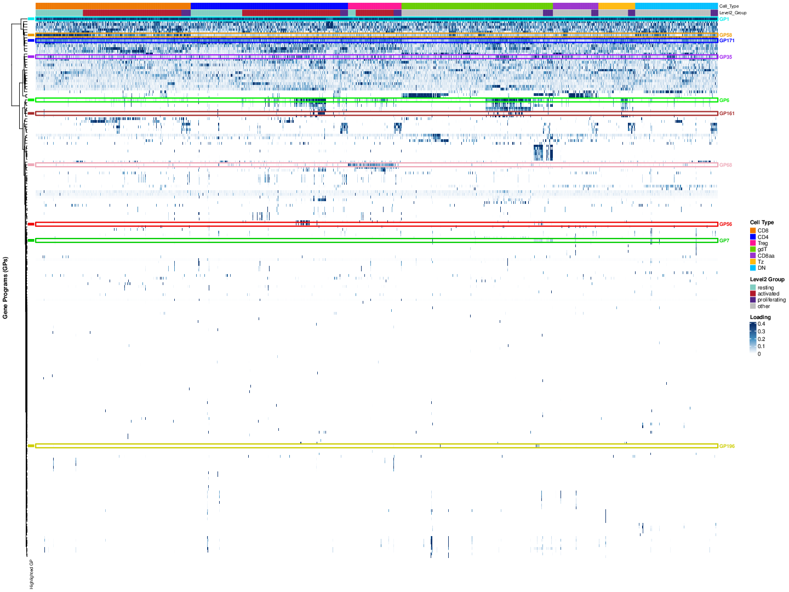

```{r doc-code, include=FALSE}
source("../code/R/doc_code.R")
```

All panels except (B) are produced by
[`script/Figure1.R`](https://github.com/AgueroZZ/immgenT-GP-analysis/blob/main/script/Figure1.R).
The code below is shown for reference (not re-executed on this page, since some
steps such as the panel-D heatmap are slow); the images are its pre-rendered
output.

## Setup

Data loading, shared across all panels below.

```{r fig1-setup1, code=code_for("../script/Figure1.R", c("doc:setup", "Load data")), eval=FALSE}
```

Panels C and D restrict to non-thymocyte cells:

```{r fig1-setup2, code=code_for("../script/Figure1.R", "doc:setup2"), eval=FALSE}
```

## (A) All-T MDE by lineage {#fig1a}

```{r fig1a-code, code=code_for("../script/Figure1.R", "1A"), eval=FALSE}
```

```{r fig1a-img, echo=FALSE, out.width="50%"}

```

::: {.figcaption}
**Fig. 1A.** Minimum distortion embedding (MDE) of all mature T cells profiled
in immgenT (the "all-T MDE", i.e. all non-thymocyte cells), colored by T cell
lineage: CD4, conventional CD4+ T cells; CD8, conventional CD8αβ+ T cells; Treg,
CD4+ Foxp3+ regulatory T cells; CD8aa, CD8αα αβ T cells; gdT, γδ T cells; Tz,
Zbtb16+ αβ T cells; DN, CD4-CD8αβ- αβ T cells; DP, CD4+CD8αβ+ αβ T cells. Cells
are subsampled per lineage for visualization.
:::

## (B) GP-representation schematic {#fig1b}

This panel is a hand-drawn schematic, not generated from R -- there is no code or pre-rendered image to show here. See `figures/Previous/bits/Figure 1/1B.pdf` for the published panel.

::: {.figcaption}
**Fig. 1B.** Schematic of the gene-program (GP) representation of T cell
gene-expression profiles. Each cell is represented by a combination of GP
activities (loadings), and each GP captures coordinated up- or downregulation of
a subset of genes. Gene programs were learned from gene expression by empirical
Bayes matrix factorization (EBMF): X ≈ LFᵀ (cells × genes matrix ≈ cells × GPs
matrix · GPs × genes matrix). See
[Methods: fitting EBMF using flashier](Methods_FlashierFit.html).
:::

## (C) Gene-program network {#fig1c}

```{r fig1c-code, code=code_for("../script/Figure1.R", "1C"), eval=FALSE}
```

```{r fig1c-img, echo=FALSE, out.width="70%"}

```

::: {.figcaption}
**Fig. 1C. Gene-program (GP) network.** A network summarizing the 200 GPs and the
signature genes they share. Each GP's **gene scores** are first normalized within
the GP (divided by that GP's maximum absolute gene score, so scores run 0–1), and
every GP is joined to its **top five up-regulated signature genes** (largest
positive normalized gene scores, ≥ 0.1). **Grey nodes are GPs** and
**tan nodes are genes**;
an edge joins a GP to each of its top signature genes, so a gene that appears
among several GPs' top genes links those GPs, and a force-directed layout places
programs with overlapping signatures near one another. A selected set of GPs is
**highlighted**, each in its own color carried along its edges to its (labeled)
top signature genes: GP68 (pink), GP58 (orange), GP35 (purple), GP171 (blue),
GP1 (cyan), GP56 (red), GP161 (dark red), GP6 (light green), GP7 (green),
GP196 (yellow). This shows each highlighted program's signature and how programs
that share genes sit together — e.g. the Treg program GP68 (*Foxp3, Il2ra,
Izumo1r*) and the CD8 program GP58 (*Cd8a, Cd8b1*) occupy distinct neighborhoods.
:::

## (D) GP loading heatmap {#fig1d}

```{r fig1d-code, code=code_for("../script/Figure1.R", "1D"), eval=FALSE}
```

```{r fig1d-img, echo=FALSE, out.width="70%"}

```

::: {.figcaption}
**Fig. 1D. GP activity heatmap.** Activity (loading) of all 200 GPs (columns)
across T cells from different organs and lineages -- a stratified sample of cells
(rows), ordered by lineage then organ; the left
strips annotate each cell's **cell type** and **organ**, and GP columns are
clustered by loading similarity. Loadings are clipped at the 99th percentile and
run white → blue. Only the GPs highlighted in the (C) network are marked and
labeled here (background GP column indices are omitted); each is shown in its
matching color via a top color bar, a colored column label, and a box drawn
around its **column**, so a program's cross-cell loading pattern can be read
alongside its position in the network. Colors: GP68 (pink), GP58 (orange),
GP35 (purple), GP171 (blue), GP1 (cyan), GP56 (red), GP161 (dark red), GP6
(light green), GP7 (green), GP196 (yellow).
:::
