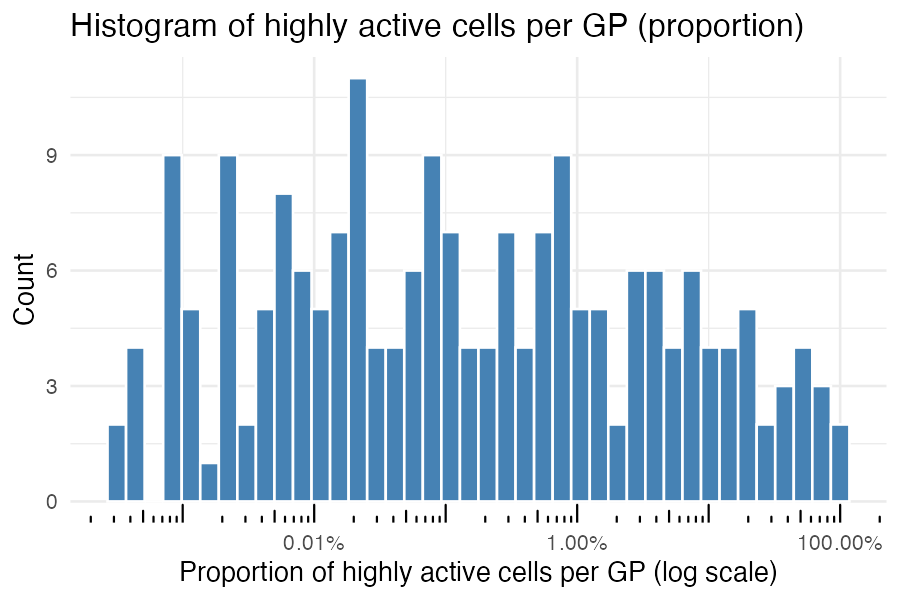
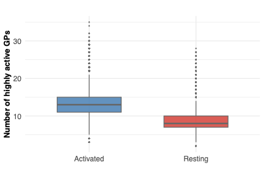

All panels are produced by
[`script/Figure2.R`](https://github.com/AgueroZZ/immgenT-GP-analysis/blob/main/script/Figure2.R).
The code below is shown for reference (not re-executed on this page); the images
are its pre-rendered output. These panels quantify how many cells and genes are
"active" in each gene program, over non-thymocyte cells.

## Setup

Data loading (non-thymocyte cells), shared across all panels below.

```{r fig2-setup, code=readLines("../script/Figure2.R")[22:45], eval=FALSE}
```

## (A) GP1 signature volcano {#fig2a}

```{r fig2a-code, code=readLines("../script/Figure2.R")[47:55], eval=FALSE}
```

```{r fig2a-img, echo=FALSE, out.width="50%"}
knitr::include_graphics("assets/Figure2/2A.png")
```

::: {.figcaption}
**Fig. 2A.** "Signature volcano" plot for one example GP (GP1): each gene's normalized score (x-axis, max |score| = 1) versus its mean shifted-log expression (y-axis), with the top-scoring genes labeled.
:::

## (B) Active-cell proportion per GP {#fig2b}

```{r fig2b-code, code=readLines("../script/Figure2.R")[57:70], eval=FALSE}
```

```{r fig2b-img, echo=FALSE, out.width="50%"}

```

::: {.figcaption}
**Fig. 2B.** Histogram of the proportion of cells with high loading (> 0.1) per GP, across all 200 GPs (x-axis on log scale).
:::

## (C) Active-gene count per GP {#fig2c}

```{r fig2c-code, code=readLines("../script/Figure2.R")[72:84], eval=FALSE}
```

```{r fig2c-img, echo=FALSE, out.width="50%"}
knitr::include_graphics("assets/Figure2/2C.png")
```

::: {.figcaption}
**Fig. 2C.** Histogram of the number of highly-active genes (|score| > 0.25 of that GP's max) per GP (x-axis on log scale).
:::

## (D) Active-GP count by lineage {#fig2d}

```{r fig2d-code, code=readLines("../script/Figure2.R")[86:106], eval=FALSE}
```

```{r fig2d-img, echo=FALSE, out.width="50%"}
knitr::include_graphics("assets/Figure2/2D.png")
```

::: {.figcaption}
**Fig. 2D.** Boxplot of the number of active GPs (loading > 0.1) per cell, grouped by major lineage.
:::

## (E) Active-GP count, activated vs. resting {#fig2e}

```{r fig2e-code, code=readLines("../script/Figure2.R")[108:124], eval=FALSE}
```

```{r fig2e-img, echo=FALSE, out.width="50%"}

```

::: {.figcaption}
**Fig. 2E.** Boxplot of the number of active GPs per cell, comparing activated versus resting cells.
:::

## (F) CD44 vs. active-GP count {#fig2f}

```{r fig2f-code, code=readLines("../script/Figure2.R")[126:140], eval=FALSE}
```

```{r fig2f-img, echo=FALSE, out.width="50%"}
knitr::include_graphics("assets/Figure2/2F.png")
```

::: {.figcaption}
**Fig. 2F.** Scatter plot of CD44 surface-protein level (log-normalized) against the number of active GPs per cell.
:::
