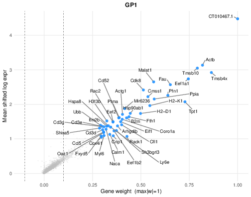
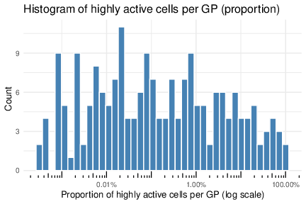
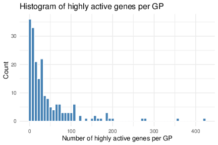
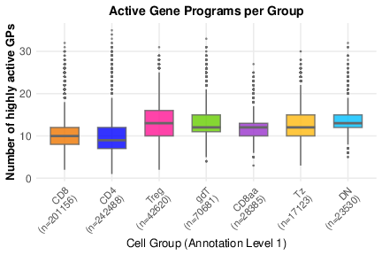
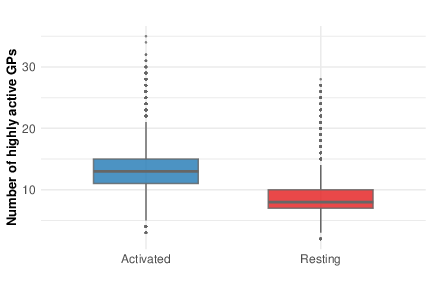
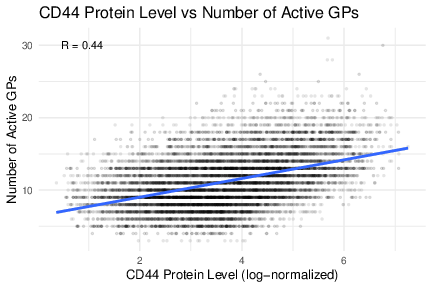

```{r doc-code, include=FALSE}
source("../code/R/doc_code.R")
```

All panels are produced by
[`script/Figure2.R`](https://github.com/AgueroZZ/immgenT-GP-analysis/blob/main/script/Figure2.R).
The code below is shown for reference (not re-executed on this page); the images
are its pre-rendered output. These panels quantify how many cells and genes are
"active" in each gene program, over non-thymocyte cells.

## Setup

Data loading (non-thymocyte cells), shared across all panels below.

```{r fig2-setup, code=code_for("../script/Figure2.R", c("doc:setup", "Load data")), eval=FALSE}
```

## (a) GP1 signature volcano {#fig2a}

```{r fig2a-code, code=code_for("../script/Figure2.R", "2A"), eval=FALSE}
```

```{r fig2a-img, echo=FALSE, out.width="50%"}

```

::: {.figcaption}
**Fig. 2a.** Gene scores for GP1, a baseline program capturing the pan-T cell
transcriptional profile. Each point represents a gene. The x-axis shows the
GP1 gene score, representing the magnitude and direction of gene regulation
within the program and scaled to a maximum absolute value of 1. The y-axis
shows mean expression across all T cells (log-normalized).
:::

## (b) Active-cell proportion per GP {#fig2b}

```{r fig2b-code, code=code_for("../script/Figure2.R", "2B"), eval=FALSE}
```

```{r fig2b-img, echo=FALSE, out.width="50%"}

```

::: {.figcaption}
**Fig. 2b.** Histogram showing the fraction of cells in which each GP was
highly active (loading greater than 0.1 in a given cell).
:::

## (c) Active-gene count per GP {#fig2c}

```{r fig2c-code, code=code_for("../script/Figure2.R", "2C"), eval=FALSE}
```

```{r fig2c-img, echo=FALSE, out.width="50%"}

```

::: {.figcaption}
**Fig. 2c.** Histogram showing the number of highly active genes per GP (genes
with an absolute score greater than 0.25 in a given GP).
:::

## (d) Active-GP count by lineage {#fig2d}

```{r fig2d-code, code=code_for("../script/Figure2.R", "2D"), eval=FALSE}
```

```{r fig2d-img, echo=FALSE, out.width="50%"}

```

::: {.figcaption}
**Fig. 2d.** Box plot showing the number of highly active GPs per cell across
T cell lineages.
:::

## (e) Active-GP count, activated vs. resting {#fig2e}

```{r fig2e-code, code=code_for("../script/Figure2.R", "2E"), eval=FALSE}
```

```{r fig2e-img, echo=FALSE, out.width="50%"}

```

::: {.figcaption}
**Fig. 2e.** Box plot showing the number of highly active GPs per cell in
activated and resting CD4+ and CD8+ T cells.
:::

## (f) CD44 vs. active-GP count {#fig2f}

```{r fig2f-code, code=code_for("../script/Figure2.R", "2F"), eval=FALSE}
```

```{r fig2f-img, echo=FALSE, out.width="50%"}

```

::: {.figcaption}
**Fig. 2f.** Scatterplot showing the number of highly active GPs per cell
correlated with CD44 protein expression (CITE-seq; log-normalized counts). The
blue line indicates the least-squares fit; Pearson’s *r* = 0.44.
:::
