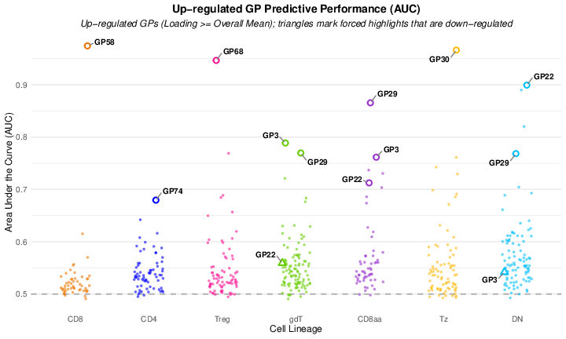
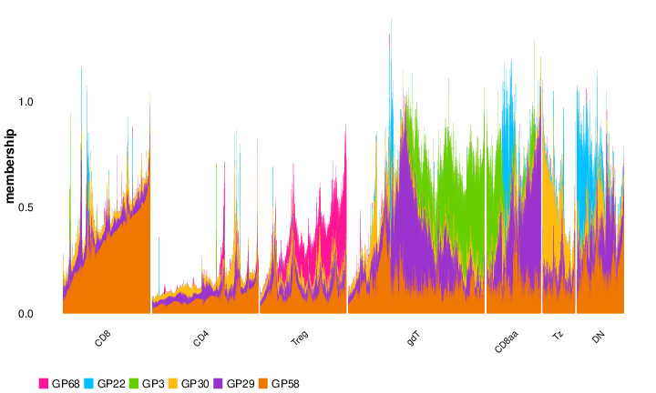
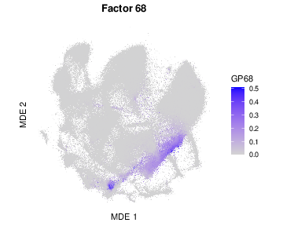
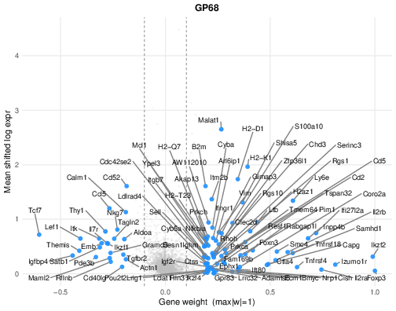
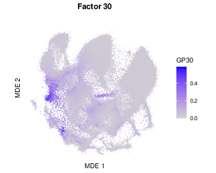
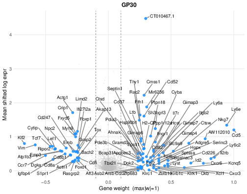
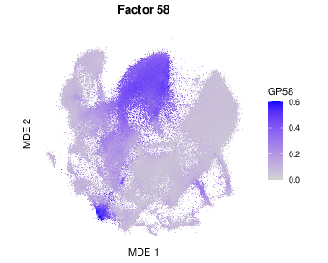
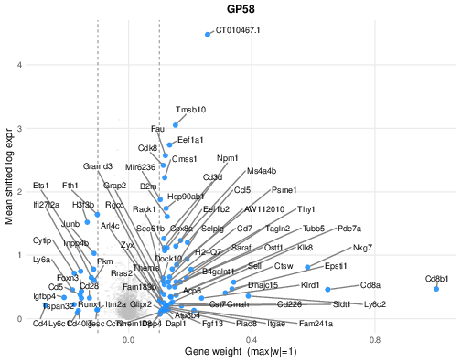
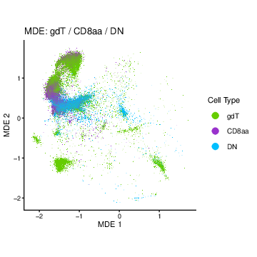
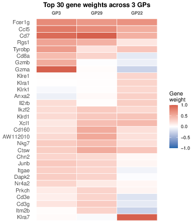

```{r doc-code, include=FALSE}
source("../code/R/doc_code.R")
```

All panels are produced by
[`script/Figure3.R`](https://github.com/AgueroZZ/immgenT-GP-analysis/blob/main/script/Figure3.R).
The code below is shown for reference (not re-executed on this page); the
images are its pre-rendered output.

## Setup

Data loading, shared across all panels below.

```{r fig3-setup, code=code_for("../script/Figure3.R", c("^", "Load data")), eval=FALSE}
```

## (A) AUC swarm plot by lineage {#fig3a}

```{r fig3a-code, code=code_for("../script/Figure3.R", "3A"), eval=FALSE}
```

```{r fig3a-img, echo=FALSE, out.width="60%"}

```

::: {.figcaption}
**Fig. 3A.** Swarm plot of per-GP predictive performance (one-vs-rest AUC, computed on healthy non-thymocyte cells) across the seven major lineages (CD8, CD4, Treg, gdT, CD8aa, Tz, DN). Only up-regulated GPs (mean loading >= the overall mean) are plotted as circles; triangles mark forced-highlight GPs (GP3, GP22, GP29) that are down-regulated in gdT, CD8aa, and DN; the dashed line marks AUC = 0.5, and the most predictive GP per lineage is labeled.
:::

## (B) Structure plot of lineage-defining GPs {#fig3b}

```{r fig3b-code, code=code_for("../script/Figure3.R", "3B"), eval=FALSE}
```

```{r fig3b-img, echo=FALSE, out.width="60%"}

```

::: {.figcaption}
**Fig. 3B.** Structure plot of the membership (GP loading) of six lineage-defining GPs (GP58, GP68, GP30, GP3, GP29, GP22) across cells grouped by major lineages (CD8, CD4, Treg, gdT, CD8aa, Tz, DN); CD4 and CD8 cells are subsampled for visualization.
:::

## (C) GP68 loading on the global MDE {#fig3c}

```{r fig3c-code, code=code_for("../script/Figure3.R", "3C/3E/3G"), eval=FALSE}
```

```{r fig3c-img, echo=FALSE, out.width="40%"}

```

::: {.figcaption}
**Fig. 3C.** GP68 loading projected onto the global MDE embedding; each point is a cell, colored by its loading for GP68.
:::

## (D) GP68 signature volcano {#fig3d}

```{r fig3d-code, code=code_for("../script/Figure3.R", "3D/3F/3H"), eval=FALSE}
```

```{r fig3d-img, echo=FALSE, out.width="40%"}

```

::: {.figcaption}
**Fig. 3D.** Per-gene view of GP68: each gene's score in the GP (x-axis, scaled so the maximum |score| = 1) versus its mean shifted-log expression (y-axis); top genes are labeled.
:::

## (E) GP30 loading on the global MDE {#fig3e}

```{r fig3e-code, code=code_for("../script/Figure3.R", "doc:3e"), eval=FALSE}
```

```{r fig3e-img, echo=FALSE, out.width="40%"}

```

::: {.figcaption}
**Fig. 3E.** GP30 loading projected onto the global MDE embedding; each point is a cell, colored by its loading for GP30.
:::

## (F) GP30 signature volcano {#fig3f}

```{r fig3f-code, code=code_for("../script/Figure3.R", "doc:3f"), eval=FALSE}
```

```{r fig3f-img, echo=FALSE, out.width="40%"}

```

::: {.figcaption}
**Fig. 3F.** Per-gene view of GP30: each gene's score in the GP (x-axis, scaled so the maximum |score| = 1) versus its mean shifted-log expression (y-axis); top genes are labeled.
:::

## (G) GP58 loading on the global MDE {#fig3g}

```{r fig3g-code, code=code_for("../script/Figure3.R", "doc:3g"), eval=FALSE}
```

```{r fig3g-img, echo=FALSE, out.width="40%"}

```

::: {.figcaption}
**Fig. 3G.** GP58 loading projected onto the global MDE embedding; each point is a cell, colored by its loading for GP58.
:::

## (H) GP58 signature volcano {#fig3h}

```{r fig3h-code, code=code_for("../script/Figure3.R", "doc:3h"), eval=FALSE}
```

```{r fig3h-img, echo=FALSE, out.width="40%"}

```

::: {.figcaption}
**Fig. 3H.** Per-gene view of GP58: each gene's score in the GP (x-axis, scaled so the maximum |score| = 1) versus its mean shifted-log expression (y-axis); top genes are labeled.
:::

## (I) gdT/CD8aa/DN MDE by lineage {#fig3i}

```{r fig3i-code, code=code_for("../script/Figure3.R", "3I"), eval=FALSE}
```

```{r fig3i-img, echo=FALSE, out.width="40%"}

```

::: {.figcaption}
**Fig. 3I.** MDE restricted to gdT, CD8aa, and DN cells (excluding proliferating and miniverse subsets), colored by lineage.
:::

## (J-L) GP22, GP29, GP3 loading on the gdT/CD8aa/DN MDE {#fig3jl}

```{r fig3jl-code, code=code_for("../script/Figure3.R", "3J/3K/3L"), eval=FALSE}
```

```{r fig3jl-img, echo=FALSE, out.width="30%"}
knitr::include_graphics(c("assets/Figure3/3J.png", "assets/Figure3/3K.png", "assets/Figure3/3L.png"))
```

::: {.figcaption}
**Fig. 3J-L.** GP loading on the same gdT/CD8aa/DN MDE for GP22 (J), GP29 (K), and GP3 (L).
:::

## (M) Top-30 gene score heatmap for GP3/GP29/GP22 {#fig3m}

```{r fig3m-code, code=code_for("../script/Figure3.R", "3M"), eval=FALSE}
```

```{r fig3m-img, echo=FALSE, out.width="40%"}

```

::: {.figcaption}
**Fig. 3M.** Heatmap of the 30 most up-regulated genes across GP3, GP29 and GP22: of the genes with a positive score in at least one of the three, the 30 with the highest score across them. Gene scores are scaled so that each GP's largest absolute score is 1 (blue, negative; red, positive), and a gene selected for one GP can still be negative in another. Rows are hierarchically clustered, with Fcer1g, Ccl5 and Cd7 pinned to the top.
:::
