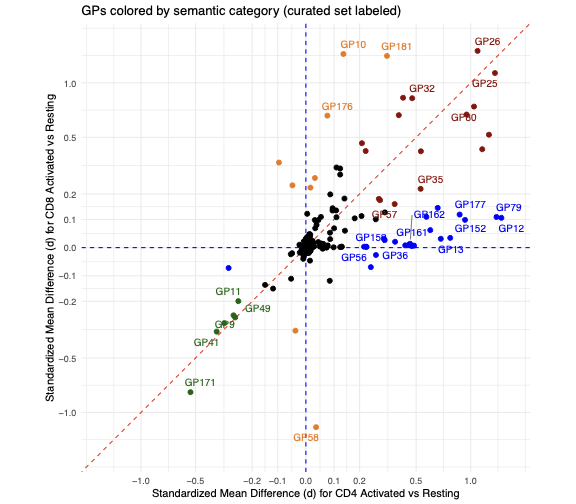
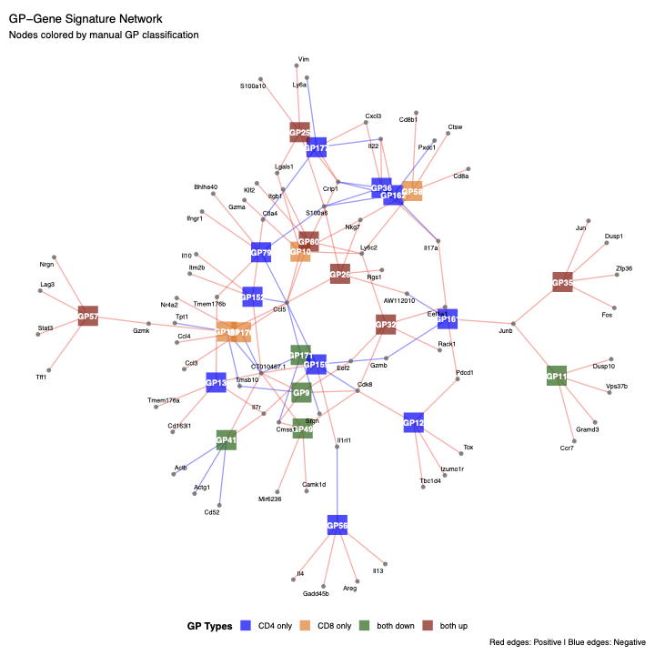
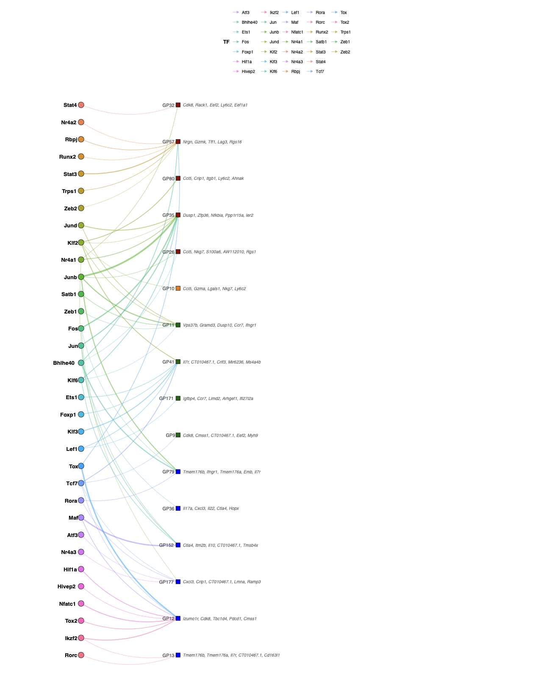
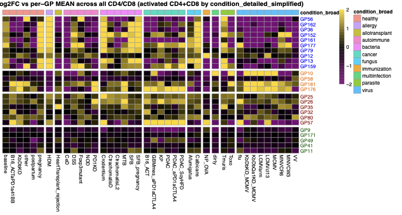
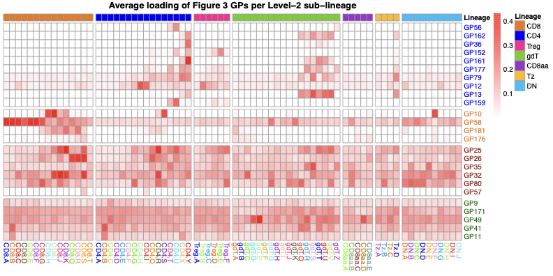

All panels are produced by
[`script/Figure4.R`](https://github.com/AgueroZZ/immgenT-GP-analysis/blob/main/script/Figure4.R),
which shares its curated GP set with [Figure S3](FigureS3.html) via
`code/R/activation_shared_setup.R`. The code below is shown for
reference (not re-executed on this page); the images are its pre-rendered
output.

## Setup

Data loading, shared across all panels below.

```{r fig3-setup, code=readLines("../script/Figure4.R")[1:50], eval=FALSE}
```

## (3c) Activation effect, CD4 vs. CD8 {#fig3c}

```{r fig3c-code, code=readLines("../script/Figure4.R")[52:100], eval=FALSE}
```

```{r fig3c-img, echo=FALSE, out.width="50%"}

```

::: {.figcaption}
**Fig. 4c.** Standardized mean difference (*d*) in GP loading between activated and resting cells, comparing CD4 (x-axis) and CD8 (y-axis); for each GP, *d* is the activated-minus-resting difference in mean loading divided by that GP's loading SD pooled over all activated and resting CD4/CD8 cells. Points are colored based on whether they are highly up-regulated in both CD4/CD8 activation, down-regulated in both, or only in CD4 or CD8 activation; GPs not meeting these criteria are shown in black, and only the curated set is labeled.
:::

## (3d) GP-gene signature network {#fig3d}

```{r fig3d-code, code=readLines("../script/Figure4.R")[102:161], eval=FALSE}
```

```{r fig3d-img, echo=FALSE, out.width="50%"}

```

::: {.figcaption}
**Fig. 4d.** GP-gene signature network in which each GP is linked to its 5 most regulated marker genes (per-GP-normalized gene scores); edges are colored by the score sign (red, positive; blue, negative).
:::

## (3e) TF-GP network {#fig3e}

```{r fig3e-code, code=readLines("../script/Figure4.R")[163:200], eval=FALSE}
```

```{r fig3e-img, echo=FALSE, out.width="50%"}

```

::: {.figcaption}
**Fig. 4e.** Bipartite transcription factor (TF)-GP network: TFs (GO:0003700 DNA-binding TFs plus the Tox family) with a normalized score exceeding 0.25 in any curated GP are connected to those GPs by directed edges (width proportional to the normalized score, color identifying the TF); the top 5 positively regulated genes per GP are listed beside each GP node.
:::

## (3f) Log2FC heatmap across conditions {#fig3f}

```{r fig3f-code, code=readLines("../script/Figure4.R")[248:299], eval=FALSE}
```

```{r fig3f-img, echo=FALSE, out.width="50%"}

```

::: {.figcaption}
**Fig. 4f.** Heatmap of log2 fold-change in mean GP loading across experimental conditions for activated CD4 and CD8 cells, computed relative to each GP's mean loading across all CD4/CD8 cells (resting and activated, all conditions) and capped at +-2, with a small pseudocount (1e-10) added to stabilize computation; columns are conditions with >=50 activated CD4 and >=50 activated CD8 cells, grouped and annotated by broad condition category, with color from purple (low) through black (no change) to gold (high).
:::

## (3g) Mean loading by sub-lineage {#fig3g}

```{r fig3g-code, code=readLines("../script/Figure4.R")[202:246], eval=FALSE}
```

```{r fig3g-img, echo=FALSE, out.width="50%"}

```

::: {.figcaption}
**Fig. 4g.** Heatmap of mean GP loading per Level-2 sub-lineage across the seven T-cell lineages (CD8, CD4, Treg, gdT, CD8aa, Tz, DN; sub-types with >=50 cells), with the top bar denoting parent lineage and color from white (low) to red (high).
:::
