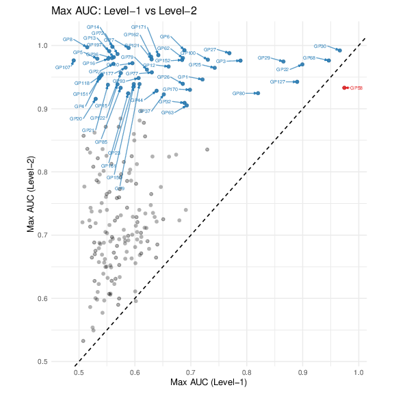
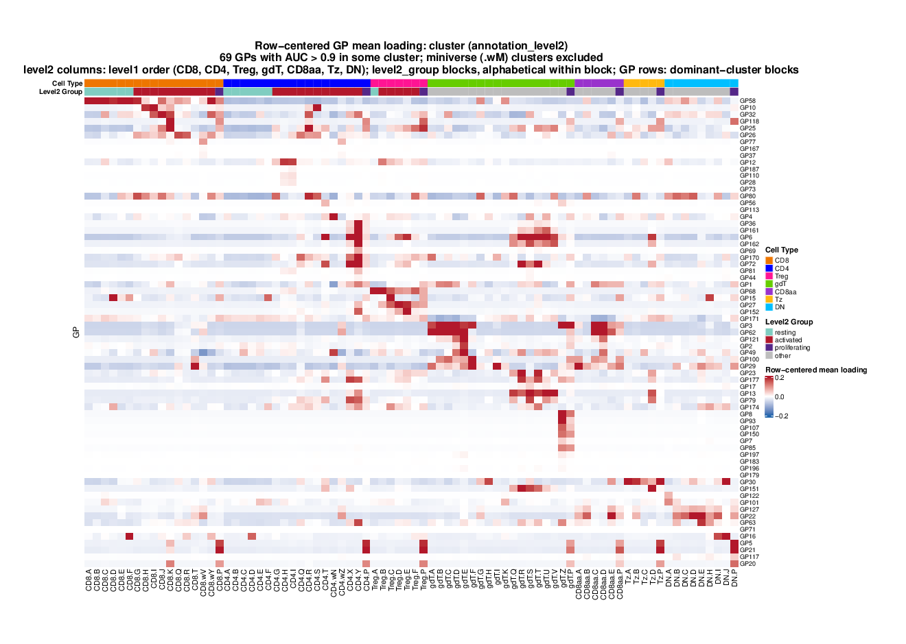
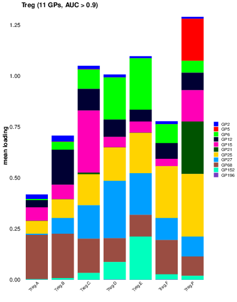
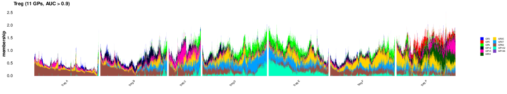
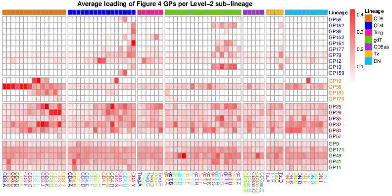

```{r doc-code, include=FALSE}
source("../code/R/doc_code.R")
```

All panels are produced by
[`script/Figure4.R`](https://github.com/AgueroZZ/immgenT-GP-analysis/blob/main/script/Figure4.R),
which shares its curated GP set with [Figure S3](FigureS3.html) via
`code/R/activation_shared_setup.R`. The code below is shown for
reference (not re-executed on this page); the images are its pre-rendered
output.

## Setup

Data loading, shared across all panels below.

```{r fig4-setup, code=code_for("../script/Figure4.R", c("^", "Load data")), eval=FALSE}
```

## (4a) Activation effect, CD4 vs. CD8 {#fig4a}

```{r fig4a-code, code=code_for("../script/Figure4.R", "4a"), eval=FALSE}
```

```{r fig4a-img, echo=FALSE, out.width="50%"}

```

::: {.figcaption}
**Fig. 4a.** Standardized mean difference (*d*) in GP activity between activated
and resting cells in CD4+ T cells (x-axis) and CD8+ T cells (y-axis); for each
GP, *d* is the activated-minus-resting difference in mean loading divided by that
GP's loading SD pooled over all activated and resting CD4/CD8 cells. Points are
colored according to whether they are highly up-regulated in both CD4+ and CD8+
activation (dark red/brown), down-regulated in both (dark green), or
preferentially regulated, in either direction, in CD4 (blue) or CD8 (orange).
Remaining GPs are shown in black; the **25** activation-associated GPs discussed
in the text are the curated set, and only those are labeled.
:::

## (4b) GP-gene signature network {#fig4b}

```{r fig4b-code, code=code_for("../script/Figure4.R", "4b"), eval=FALSE}
```

```{r fig4b-img, echo=FALSE, out.width="50%"}

```

::: {.figcaption}
**Fig. 4b.** GP-gene network in which each of these 25 GPs is linked to its five most strongly regulated genes, based on per-GP-normalized GP gene scores; edges are colored by the sign of the gene score (red, up-regulated; blue, down-regulated). GP nodes are colored as in (4a).
:::

## (4c) TF-GP network {#fig4c}

```{r fig4c-code, code=code_for("../script/Figure4.R", "4c"), eval=FALSE}
```

```{r fig4c-img, echo=FALSE, out.width="50%"}

```

::: {.figcaption}
**Fig. 4c.** Transcription factor (TF)-GP network: TFs (GO:0003700 DNA-binding TFs plus the Tox family) with a score greater than 0.25 in any of these 25 GPs are shown, connected to those GPs by directed edges whose width scales with the score (color identifies the TF). The top five up-regulated **non-TF** genes in each GP are listed beside the corresponding GP node (genes already drawn as TF nodes are excluded from that list).
:::

## (4d) Log2FC heatmap across conditions {#fig4d}

```{r fig4d-code, code=code_for("../script/Figure4.R", "4d"), eval=FALSE}
```

```{r fig4d-img, echo=FALSE, out.width="50%"}

```

::: {.figcaption}
**Fig. 4d.** Heatmap of log2 fold change in mean GP activity across experimental conditions for activated CD4+ and CD8+ T cells, computed relative to each GP's mean loading across all CD4+/CD8+ cells (resting and activated, all conditions) and capped at +-2, with a small pseudocount (1e-10) added to stabilize computation. Columns are conditions with >=50 activated CD4 and >=50 activated CD8 cells, grouped and annotated by broad condition category (including healthy controls), with color from purple (low) through black (no change) to gold (high). GPs are ordered and colored as in (4a).
:::

## (4e) Mean loading by sub-lineage {#fig4e}

```{r fig4e-code, code=code_for("../script/Figure4.R", "4e"), eval=FALSE}
```

```{r fig4e-img, echo=FALSE, out.width="50%"}

```

::: {.figcaption}
**Fig. 4e.** Heatmap of mean GP activity per level 2 cluster (sub-lineage), with the top bar denoting parent lineage; thymocytes and DP cells are excluded, leaving the seven T-cell lineages (CD8, CD4, Treg, gdT, CD8aa, Tz, DN) and only sub-types with >=50 cells. Color runs from white (low) to red (high). GPs are ordered and colored as in (4a).
:::
