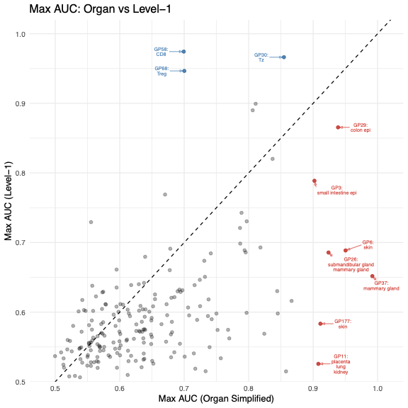
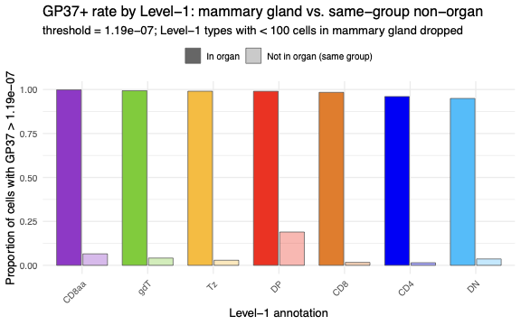
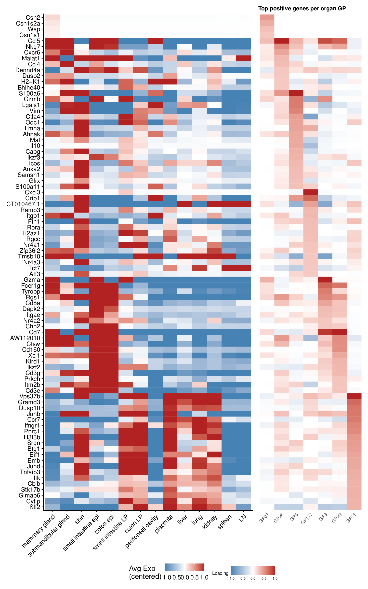
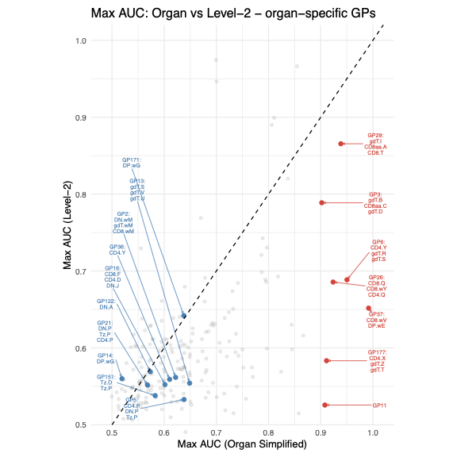

All panels are produced by
[`script/Figure5.R`](https://github.com/AgueroZZ/immgenT-GP-analysis/blob/main/script/Figure5.R).
The code below is shown for reference (not re-executed on this page); the
images are its pre-rendered output.

## Setup

Data loading, shared across all panels below.

```{r fig4-setup, code=readLines("../script/Figure5.R")[1:91], eval=FALSE}
```

## (a) Max AUC: organ vs. lineage {#fig4a}

```{r fig4a-code, code=readLines("../script/Figure5.R")[92:180], eval=FALSE}
```

```{r fig4a-img, echo=FALSE, out.width="60%"}

```

::: {.figcaption}
**Fig. 5a.** Per-GP maximum AUC for predicting organ of origin (x-axis) versus lineage (y-axis); each point is one GP and the dashed line marks equal performance. Categories with too few cells are dropped (lineage < 1,000 cells, organ < 100 cells). GPs reaching AUC > 0.9 on either axis are highlighted -- red below the diagonal (better at organ; organ-specific) labeled with their top organs, blue above the diagonal (better at lineage) labeled with their top lineages (up to three categories each, AUC > 0.85).
:::

## (b) GP37+ rate in mammary gland vs. elsewhere {#fig4b}

```{r fig4b-code, code=readLines("../script/Figure5.R")[247:341], eval=FALSE}
```

```{r fig4b-img, echo=FALSE, out.width="60%"}

```

::: {.figcaption}
**Fig. 5b.** GP37+ rate by lineage in mammary gland versus the same lineage elsewhere. A cell is GP37+ if its GP37 loading exceeds the organ-specific optimal threshold from the AUC analysis. For each lineage, the solid bar is the fraction of mammary-gland cells of that lineage that are GP37+ and the faded bar is the fraction of the same lineage outside mammary gland; bars are colored by lineage and ordered by in-organ rate, and lineages with < 100 cells in mammary gland are dropped.
:::

## (c) Marker genes of the 7 organ-specific GPs {#fig4c}

```{r fig4c-code, code=readLines("../script/Figure5.R")[390:491], eval=FALSE}
```

```{r fig4c-img, echo=FALSE, out.width="60%"}

```

::: {.figcaption}
**Fig. 5c.** Marker genes of the seven organ-specific GPs. Genes are the union of the top 20 positively scoring genes per GP (score > 0.25 on the max-abs-scaled gene-score matrix), ordered diagonally by each gene's dominant GP and then by descending score. Left, heatmap of mean expression across 14 organs, **centered** per gene (each gene's across-organ mean subtracted; not standardized / not divided by SD), with color clipped to [-1, 1] so mid-range genes stay visible; right, heatmap of the per-GP scaled gene scores for the same genes across the seven GPs, centered at zero (blue, negative; red, positive).
:::

## (d) Max AUC: organ vs. cluster {#fig4d}

```{r fig4d-code, code=readLines("../script/Figure5.R")[181:246], eval=FALSE}
```

```{r fig4d-img, echo=FALSE, out.width="60%"}

```

::: {.figcaption}
**Fig. 5d.** As in (a), but predictive performance is measured against clusters obtained from ImmgenT-cosmo (y-axis; clusters with < 100 cells dropped). All GPs are shown in grey; the seven organ-specific GPs (GP3, GP6, GP11, GP26, GP29, GP37, GP177) are highlighted in red and labeled with their best clusters, while a contrasting set of cluster-specific GPs (high cluster AUC, low organ AUC) is highlighted in blue; the dashed line marks equal performance.
:::

## (e) Organ, GP, and cluster alluvial diagram {#fig4e}

```{r fig4e-code, code=readLines("../script/Figure5.R")[342:389], eval=FALSE}
```

```{r fig4e-img, echo=FALSE, out.width="80%"}
knitr::include_graphics("assets/Figure5/5e.png")
```

::: {.figcaption}
**Fig. 5e.** Alluvial diagram of GP+ cells linking organ of origin, GP, and ImmgenT-cosmo cluster. For each of the seven organ-specific GPs, GP+ cells (loading above that GP's best-organ threshold) are subsampled to <=300 per GP and traced from their organ of origin through the GP to their cluster; flows are colored by GP (using each GP's best-predicted organ color), flows representing fewer than 5 cells are dropped, and a cell may appear under more than one GP. Axis width denotes the number of GP+ cells.
:::
