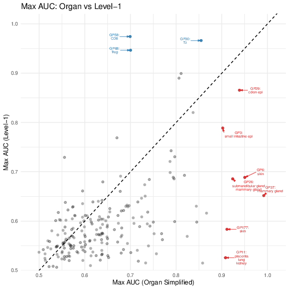
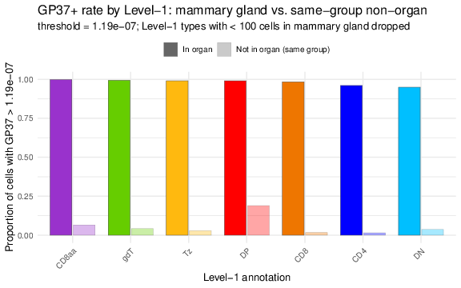
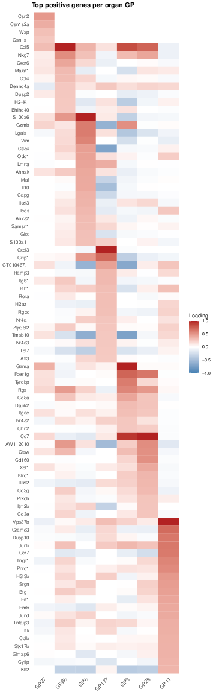
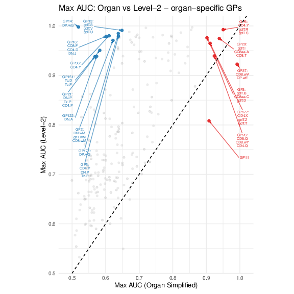
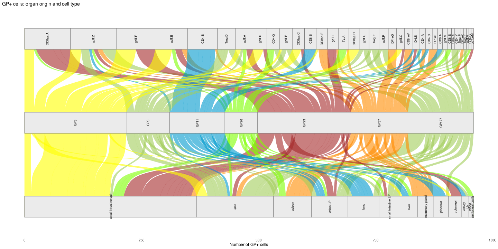

```{r doc-code, include=FALSE}
source("../code/R/doc_code.R")
```

All panels are produced by
[`script/Figure5.R`](https://github.com/AgueroZZ/immgenT-GP-analysis/blob/main/script/Figure5.R).
The code below is shown for reference (not re-executed on this page); the
images are its pre-rendered output.

## Setup

Data loading, shared across all panels below.

```{r fig5-setup, code=code_for("../script/Figure5.R", c("^", "Load data")), eval=FALSE}
```

## (a) Max AUC: organ vs. lineage {#fig5a}

```{r fig5a-code, code=code_for("../script/Figure5.R", "5a"), eval=FALSE}
```

```{r fig5a-img, echo=FALSE, out.width="60%"}

```

::: {.figcaption}
**Fig. 5a.** Per-GP maximum AUC for predicting organ of origin (x-axis) versus lineage (y-axis); each point is one GP and the dashed line marks equal performance. Categories with too few cells are dropped (lineage < 1,000 cells, organ < 100 cells). GPs reaching AUC > 0.9 on either axis are highlighted -- red below the diagonal (better at organ; organ-specific) labeled with their top organs, blue above the diagonal (better at lineage) labeled with their top lineages (up to three categories each, AUC > 0.85).
:::

## (b) GP37+ rate in mammary gland vs. elsewhere {#fig5b}

```{r fig5b-code, code=code_for("../script/Figure5.R", "5b"), eval=FALSE}
```

```{r fig5b-img, echo=FALSE, out.width="60%"}

```

::: {.figcaption}
**Fig. 5b.** Proportion of GP37-active cells in each lineage in the mammary gland (solid bars) compared with the same lineage in all other organs (faded bars). A cell is GP37-active (GP37+) if its GP37 loading exceeds the organ-specific optimal threshold from the AUC analysis. Bars are colored by lineage and ordered by in-organ rate; lineages with fewer than 100 mammary-gland cells are omitted.
:::

## (c) Marker genes of the 7 organ-specific GPs {#fig5c}

```{r fig5c-code, code=code_for("../script/Figure5.R", "5c"), eval=FALSE}
```

```{r fig5c-img, echo=FALSE, out.width="60%"}

```

::: {.figcaption}
**Fig. 5c.** Marker genes of the seven organ-specific GPs. Genes are the union of the top 20 positively scoring genes per GP (score > 0.25 on the max-abs-scaled gene-score matrix), ordered diagonally by each gene's dominant GP and then by descending score. Heatmap of the per-GP scaled gene scores for these genes across the seven GPs, centered at zero (blue, negative; red, positive).
:::

## (d) Max AUC: organ vs. cluster {#fig5d}

```{r fig5d-code, code=code_for("../script/Figure5.R", c("5d prep", "5d:")), eval=FALSE}
```

```{r fig5d-img, echo=FALSE, out.width="60%"}

```

::: {.figcaption}
**Fig. 5d.** As in (a), but predictive performance is measured against level 2 clusters (`annotation_level2`, from ImmgenT-cosmo; y-axis, clusters with < 100 cells dropped). All GPs are shown in grey; the seven organ-specific GPs from (a) -- GP3, GP6, GP11, GP26, GP29, GP37, GP177 -- are highlighted in red and labeled with their best clusters, and a contrasting set of cluster-specific GPs (high cluster AUC, low organ AUC) in blue; the dashed line marks equal performance.
:::

## (e) Organ, GP, and cluster alluvial diagram {#fig5e}

```{r fig5e-code, code=code_for("../script/Figure5.R", "5e"), eval=FALSE}
```

```{r fig5e-img, echo=FALSE, out.width="80%"}

```

::: {.figcaption}
**Fig. 5e.** Alluvial plot showing how tissue-specific GP activity is distributed across clusters. For each of the seven organ-specific GPs and each organ, GP-active cells (loading above that GP's best-organ threshold) are traced from their organ of origin through the GP to their level 2 cluster annotation. Flows are colored by GP (using each GP's best-predicted organ color), and width is proportional to the number of cells shown, after subsampling to <=300 cells per GP; flows representing fewer than 5 cells are dropped, and a cell may appear under more than one GP.
:::
