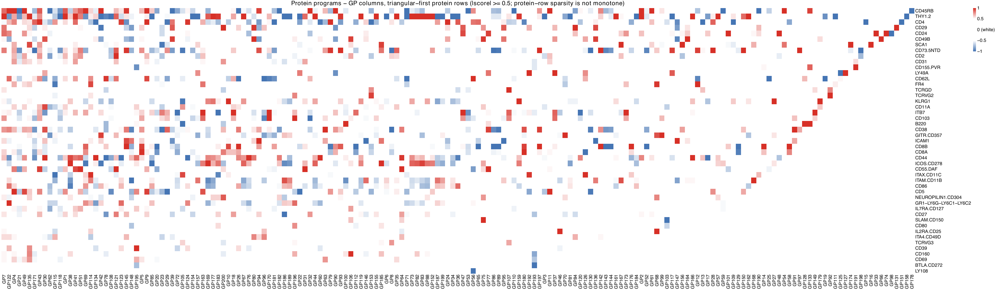

All panels except (a) are produced by
[`script/Figure6.R`](https://github.com/AgueroZZ/immgenT-GP-analysis/blob/main/script/Figure6.R),
which shares its CITE-seq setup with [Figure S6](FigureS6.html) via
`code/R/citeseq_shared_setup.R`. The code below is shown for
reference (not re-executed on this page, since this script takes about a
minute to run); the images are its pre-rendered output.

## Setup

```{r fig6-setup, code=readLines("../script/Figure6.R")[36:46], eval=FALSE}
```

Panels (b) onward additionally load the shared CITE-seq cell/protein setup:

```{r fig6-setup2, code=readLines("../script/Figure6.R")[50:64], eval=FALSE}
```

## (a) Projection schematic {#fig6a}

This panel is a hand-drawn schematic, not generated from R -- there is no code or pre-rendered image to show here. See `figures/final-selected/bits/Figure 6/6a.pdf` for the published panel.

## (b) Protein-program heatmap {#fig6b}

```{r fig6b-code, code=readLines("../script/Figure6.R")[66:90], eval=FALSE}
```

```{r fig6b-img, echo=FALSE, out.width="80%"}

```

::: {.figcaption}
**Fig. 6b.** Heatmap of the re-estimated protein matrix (U). The protein scores in each GP are scaled so its maximum |score| = 1, after removing isotype and low-quality proteins and four putative contamination GPs (GP40, GP50, GP55, GP188); 47 proteins (columns) x 179 GPs (rows). Entries with |score| < 0.5 are shown white, with color running from blue (-1) through white to red (+1).
:::

## (c-f) Protein-gated vs. GP-loading populations {#fig6cf}

```{r fig6cf-code, code=readLines("../script/Figure6.R")[92:117], eval=FALSE}
```

```{r fig6cf-img, echo=FALSE, out.width="49%"}
knitr::include_graphics(c(
  "assets/Figure6/6c.png", "assets/Figure6/6d.png",
  "assets/Figure6/6e.png", "assets/Figure6/6f.png"
))
```

::: {.figcaption}
**Fig. 6c-f.** Transcriptional GPs recover protein-gated populations. For each GP, cells are shown twice on the same MDE embedding. Left, cells passing a protein gate built from the GP's curated marker signature (positive markers above, and negative markers below); right, an equally sized set of cells with the highest GP loading (the loading cutoff is chosen to match the protein-gate count). Highlighted cells are colored by two-dimensional density and all other cells are grey; thymocytes, proliferating, and "miniverse" cells are excluded.
:::

## (g, h) KLRG1 modulation across lineages {#fig6gh}

```{r fig6gh-code, code=readLines("../script/Figure6.R")[119:184], eval=FALSE}
```

```{r fig6gh-img, echo=FALSE, out.width="49%"}
knitr::include_graphics(c("assets/Figure6/6g.png", "assets/Figure6/6h.png"))
```

::: {.figcaption}
**Fig. 6g, h.** KLRG1 modulation of GPs across lineages. Within each lineage, cells are split KLRG1+ versus KLRG1- based on the threshold on the KLRG1 protein, and for every GP the effect size is the difference in mean GP loading (KLRG1+ minus KLRG1-). The scatter compares CD8 (x-axis) against CD4 (g) or Treg (h) (y-axis); each point is a GP, the dashed red line marks equal effect (y = x), and the dashed blue lines mark zero. Selected GPs are labeled -- orange for large, concordant effects in both lineages, and blue/pink for lineage-biased GPs.
:::

## (i-k) GPs associated with CD69 {#fig6ik}

```{r fig6ik-code, code=readLines("../script/Figure6.R")[186:274], eval=FALSE}
```

```{r fig6ik-img, echo=FALSE, out.width="32%"}
knitr::include_graphics(c("assets/Figure6/6i.png", "assets/Figure6/6j.png", "assets/Figure6/6k.png"))
```

::: {.figcaption}
**Fig. 6i-k.** GPs associated with CD69. The ten GPs most associated with CD69 are ordered by the Spearman correlation between CD69 protein expression and GP loading. (i) Heatmap of the top five gene scores per GP (green-white-purple), with a left strip giving each GP's CD69 correlation (blue-white-red). (j) Mean loading of these GPs per tissue and (k) per lineage.
:::
