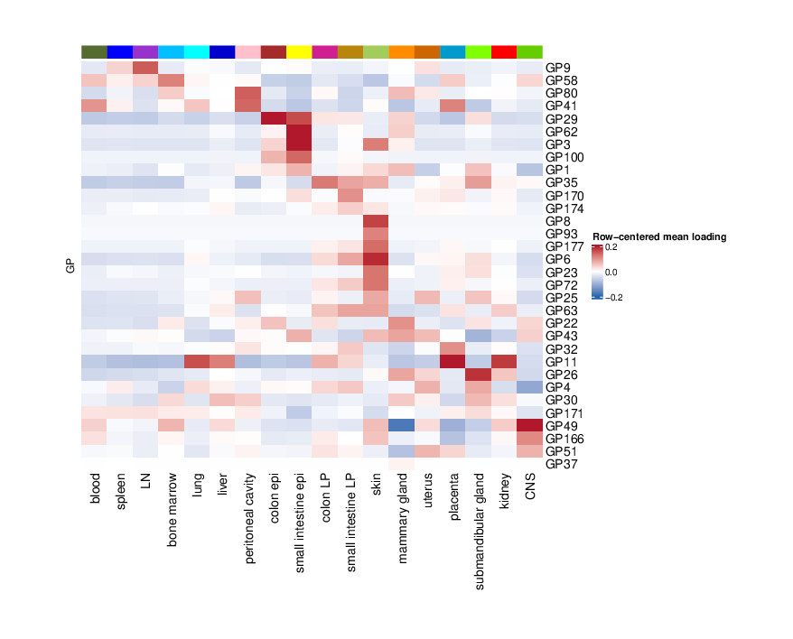
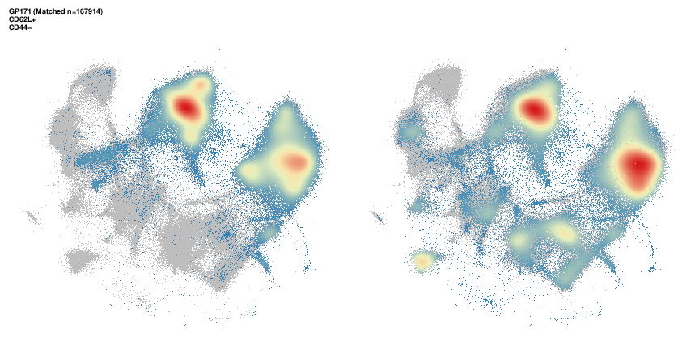
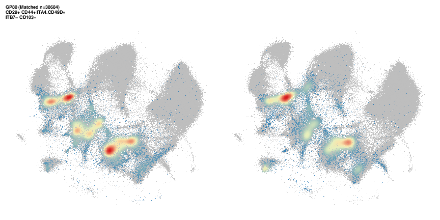

```{r doc-code, include=FALSE}
source("../code/R/doc_code.R")
```

All panels are produced by
[`script/Figure6.R`](https://github.com/AgueroZZ/immgenT-GP-analysis/blob/main/script/Figure6.R).
The code below is shown for reference (not re-executed on this page); the
images are its pre-rendered output.

## Setup

Data loading, shared across all panels below.

```{r fig6-setup, code=code_for("../script/Figure6.R", c("^", "Load data")), eval=FALSE}
```

## (a) Max AUC: organ vs. lineage {#fig6a}

```{r fig6a-code, code=code_for("../script/Figure6.R", "6a"), eval=FALSE}
```

```{r fig6a-img, echo=FALSE, out.width="60%"}

```

::: {.figcaption}
**Fig. 6a.** Scatterplot showing each GP's prediction (AUC) of organ of origin
(x-axis) versus lineage (y-axis). GPs reaching AUC > 0.9 on either axis are
colored and labeled (organ-specific in red; lineage-specific in blue).
:::

## (b) GP37+ rate in mammary gland vs. elsewhere {#fig6b}

```{r fig6b-code, code=code_for("../script/Figure6.R", "6b"), eval=FALSE}
```

```{r fig6b-img, echo=FALSE, out.width="60%"}
knitr::include_graphics("assets/Figure6/6b.png")
```

::: {.figcaption}
**Fig. 6b.** Proportion of GP37-active cells in each lineage in the mammary
gland compared with all other organs (faded color bar).
:::

## (c) Marker genes of the 7 organ-specific GPs {#fig6c}

```{r fig6c-code, code=code_for("../script/Figure6.R", "6c"), eval=FALSE}
```

```{r fig6c-img, echo=FALSE, out.width="60%"}

```

::: {.figcaption}
**Fig. 6c.** Genes associated with the seven organ-specific GPs shown in (a).
Heatmap of the per-GP scaled gene scores for the top upregulated genes of each
GP (top 20 per GP, gene score > 0.25; blue, negative; red, positive).
:::

## (d) Max AUC: organ vs. cluster {#fig6d}

```{r fig6d-code, code=code_for("../script/Figure6.R", c("6d prep", "6d:")), eval=FALSE}
```

```{r fig6d-img, echo=FALSE, out.width="60%"}
knitr::include_graphics("assets/Figure6/6d.png")
```

::: {.figcaption}
**Fig. 6d.** As in (a), but predictive performance is measured against level 2
clusters (y-axis). The seven organ-specific GPs from (a) are highlighted in
red, and a contrasting set of cluster-specific GPs (high cluster AUC, low
organ AUC) in blue.
:::

## (e) Organ, GP, and cluster alluvial diagram {#fig6e}

```{r fig6e-code, code=code_for("../script/Figure6.R", "6e"), eval=FALSE}
```

```{r fig6e-img, echo=FALSE, out.width="80%"}

```

::: {.figcaption}
**Fig. 6e.** Alluvial plot showing how tissue-specific GP activity is
distributed across clusters. For each organ, GP-active cells are traced to
their cluster annotation. Flows are colored by GP, and width is proportional
to the number of cells.
:::
