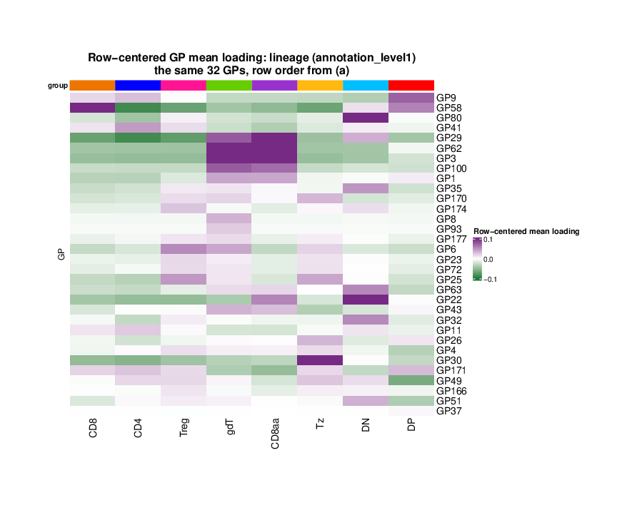

```{r doc-code, include=FALSE}
source("../code/R/doc_code.R")
```

All panels except (a) are produced by
[`script/Figure6.R`](https://github.com/AgueroZZ/immgenT-GP-analysis/blob/main/script/Figure6.R),
which shares its CITE-seq setup with [Figure S6](FigureS6.html) via
`code/R/citeseq_shared_setup.R`. The code below is shown for
reference (not re-executed on this page, since this script takes about a
minute to run); the images are its pre-rendered output.

## Setup

```{r fig6-setup, code=code_for("../script/Figure6.R", "doc:setup"), eval=FALSE}
```

Panels (b) onward additionally load the shared CITE-seq cell/protein setup:

```{r fig6-setup2, code=code_for("../script/Figure6.R", "Load data"), eval=FALSE}
```

## (a) Protein-signature schematic {#fig6a}

This panel is a hand-drawn schematic, not generated from R -- there is no code or pre-rendered image to show here. See `figures/Previous/bits/Figure 6/6a.pdf` for the published panel.

::: {.figcaption}
**Fig. 6a.** Schematic illustrating how protein signatures were defined for each
GP. Holding the cell-loading matrix **L** fixed from the GP model, a protein
factor matrix was estimated by EBMF from the paired CITE-seq protein
measurements, Y ≈ LUᵀ (cells × proteins matrix), yielding a protein signature
**U** (proteins × GPs matrix) for each GP. See
[Methods: fitting CITE-seq protein programs with fixed scRNA loadings](Methods_FlashierFit_Citeseq.html).
:::

## (b) Protein-program heatmap {#fig6b}

```{r fig6b-code, code=code_for("../script/Figure6.R", "6b"), eval=FALSE}
```

```{r fig6b-img, echo=FALSE, out.width="100%"}

```

::: {.figcaption}
**Fig. 6b.** Heatmap of scaled protein scores for each GP (the re-estimated
protein matrix **U**), with the protein scores in each GP scaled so its maximum
|score| = 1. We focused on the **47 proteins** that performed best in the immgenT
CITE-seq dataset (isotype and low-quality proteins removed).
**Seventeen GPs lacked meaningful protein correlates** -- every protein score is
exactly zero -- and were omitted. Four putative contamination programs (GP40,
GP50, GP55 and GP188) were also removed, leaving **179 GPs**
(200 - 17 - 4 = 179); 47 proteins (rows) x 179 GPs (columns). Entries with an
absolute score below 0.5 are shown in white, with color running from blue (-1)
through white to red (+1). GP columns are ordered from the most to the fewest visible proteins. Protein rows are ordered by the position of their rightmost visible GP, placing proteins that extend into the sparse right side first and exposing a triangular support boundary; visible count and a rarity-weighted support score break ties. This triangular-first row order is not monotone in per-protein sparsity. GP labels are vertical and sized to the available heatmap-cell width; protein labels are sized to the available row height.
:::

## (c-f) Protein-gated vs. GP-loading populations {#fig6cf}

```{r fig6cf-code, code=code_for("../script/Figure6.R", "6c-6f"), eval=FALSE}
```

```{r fig6cf-img, echo=FALSE, out.width="49%"}
knitr::include_graphics(c(
  "assets/Figure6/6c.png", "assets/Figure6/6d.png",
  "assets/Figure6/6e.png", "assets/Figure6/6f.png"
))
```

::: {.figcaption}
**Fig. 6c-f.** Examples of gating strategies used to identify GP-active cells, for
**(c) GP171, (d) GP12, (e) GP80 and (f) GP23**. For each GP, cells are shown twice
on the same MDE embedding. Left, cells selected by the proposed protein gate,
built from the GP's curated marker signature (positive markers above, and negative
markers below); right, an equally sized set of cells with the highest GP activity
(the loading cutoff is chosen to match the protein-gate count). Color indicates
cell density (two-dimensional); all other cells are grey. Thymocytes,
proliferating, and "miniverse" cells are excluded.
:::

## (g, h) KLRG1 modulation across lineages {#fig6gh}

```{r fig6gh-code, code=code_for("../script/Figure6.R", "6g/6h"), eval=FALSE}
```

```{r fig6gh-img, echo=FALSE, out.width="49%"}
knitr::include_graphics(c("assets/Figure6/6g.png", "assets/Figure6/6h.png"))
```

::: {.figcaption}
**Fig. 6g, h.** GPs associated with KLRG1 protein expression in CD4, Tregs and CD8. Within each lineage, cells are split KLRG1+ versus KLRG1- based on the threshold on the KLRG1 protein, and for every GP the effect size is the difference in its mean activity between KLRG1+ and KLRG1- cells. These effect-size versus effect-size plots compare CD8+ T cells (x-axis) with CD4+ T cells (g) or Treg cells (h) (y-axis); each point is a GP, the dashed red line marks equal effect (y = x), and the dashed blue lines mark zero. Selected GPs are labeled -- orange for large, concordant effects in both lineages, and blue/pink for lineage-biased GPs.
:::

## (i-k) GPs associated with CD69 {#fig6ik}

```{r fig6ik-code, code=code_for("../script/Figure6.R", "6i/6j/6k"), eval=FALSE}
```

```{r fig6ik-img, echo=FALSE, out.width="32%"}
knitr::include_graphics(c("assets/Figure6/6i.png", "assets/Figure6/6j.png", "assets/Figure6/6k.png"))
```

::: {.figcaption}
**Fig. 6i-k.** GPs associated with CD69 protein expression. Ten representative GPs
associated with CD69, selected from among those most strongly correlated --
positively or negatively -- with CD69 protein expression, ordered by the Spearman
correlation between GP activity and CD69 expression.
(i) Heatmap of the genes most strongly **up- and down-regulated** across these
GPs: per GP, the top five positively and top five negatively scoring genes, then
restricted to genes reaching |score| >= 0.5 in at least one of the ten
(green-white-purple), with the left strip indicating each GP's Spearman
correlation with CD69 (blue-white-red).
(j) Mean activity of these GPs across tissues and (k) across lineages.

The ten GPs are a **hand-picked** set, not a computed top-10: eight are
positively correlated with CD69 (ranks 1, 3, 4, 5, 6, 10, 12 and 14 of 200) and
GP58/GP171 are the two most *negatively* correlated GPs of all 200.
`script/verify_cd69_gp_ranking.R` recomputes the correlation over all 200 GPs and
fails if this wording and the code drift apart.
:::
