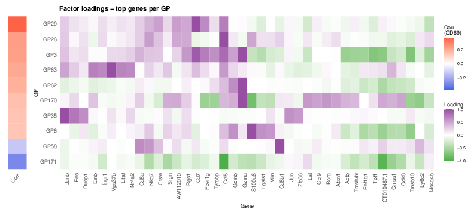

```{r doc-code, include=FALSE}
source("../code/R/doc_code.R")
```

All panels except (a) are produced by
[`script/Figure7.R`](https://github.com/AgueroZZ/immgenT-GP-analysis/blob/main/script/Figure7.R).
The code below is shown for reference; the images are its pre-rendered output.

## Setup

```{r fig7-setup, code=code_for("../script/Figure7.R", "doc:setup"), eval=FALSE}
```

```{r fig7-setup2, code=code_for("../script/Figure7.R", "Load data"), eval=FALSE}
```

## (a) Protein-signature schematic {#fig7a}

A hand-drawn schematic, not generated from code. The protein factor matrix is
documented in
[Methods: fitting CITE-seq protein programs with fixed scRNA loadings](Methods_FlashierFit_Citeseq.html).

::: {.figcaption}
**Fig. 7a.** Schematic illustrating how protein signatures were defined for
each GP. Holding the cell-loading matrix L fixed from the GP model, a protein
factor matrix was estimated by EBMF from the paired CITE-seq protein
measurements, Y ≈ LUᵀ (cells × proteins matrix), yielding a protein signature
U (proteins × GPs matrix) for each GP.
:::

## (b, c) KLRG1 modulation across lineages {#fig7bc}

```{r fig7bc-code, code=code_for("../script/Figure7.R", "7b"), eval=FALSE}
```

```{r fig7bc-img, echo=FALSE, out.width="49%"}
knitr::include_graphics(c("assets/Figure7/7b.png", "assets/Figure7/7c.png"))
```

::: {.figcaption}
**Fig. 7b, c.** GPs associated with KLRG1 protein expression in CD4, Tregs,
and CD8. Effect-size versus effect-size plots, where each GP's effect size is
the difference in its mean activity between KLRG1+ and KLRG1- cells, comparing
CD8+ T cells (x-axis) with CD4+ T cells (b) or Treg cells (c).
:::

## (d) Genes up- and down-regulated across the CD69-associated GPs {#fig7d}

```{r fig7d-gps, code=code_for("../code/R/citeseq_shared_setup.R", "doc:cd69"), eval=FALSE}
```

```{r fig7d-code, code=code_for("../script/Figure7.R", "7d"), eval=FALSE}
```

```{r fig7d-img, echo=FALSE, out.width="100%"}

```

::: {.figcaption}
**Fig. 7d.** Heatmap of the top five most strongly up- and down-regulated gene
scores for ten GPs correlated with CD69 expression, with the left strip
indicating the Spearman correlation between GP activity and CD69 expression.
:::

## (e-j) Protein-gated vs. GP-loading populations {#fig7ej}

```{r fig7ej-code, code=code_for("../script/Figure7.R", "7e"), eval=FALSE}
```

```{r fig7ej-img, echo=FALSE, out.width="49%"}
knitr::include_graphics(c(
  "assets/Figure7/7e.png", "assets/Figure7/7f.png",
  "assets/Figure7/7g.png", "assets/Figure7/7h.png",
  "assets/Figure7/7i.png", "assets/Figure7/7j.png"
))
```

::: {.figcaption}
**Fig. 7e-j.** Examples of gating strategies used to identify GP-active cells.
All-T MDE plots highlight cells selected by the proposed gating strategy
(left) and the corresponding GP-active cells (right). Color indicates cell
density.
:::
