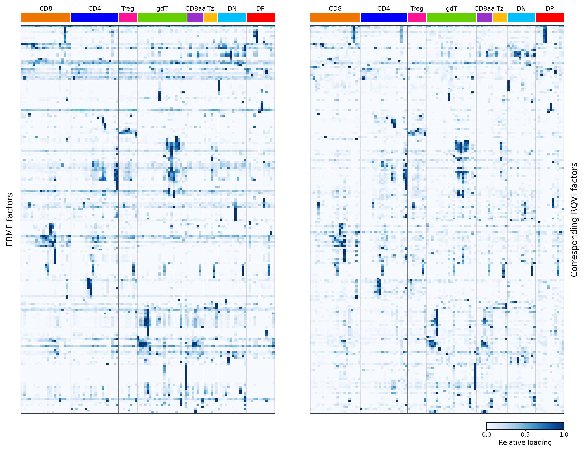

Figure 7 (RQVI validates EBMF-derived gene programs with a non-linear deep
learning framework) is otherwise produced by our collaborator's RQVI pipeline,
not by this repository: panels **7a and 7c-7g have no code here** (7a is a Figma
schematic, 7c/7d/7f are Matplotlib output whose source is not in this repo, and
7e/7g trace to RQVI validation code that was scoped out -- see
[`script/README.md`](https://github.com/AgueroZZ/immgenT-GP-analysis/blob/main/script/README.md)).
This page covers **panel 7b only**, which is ours.

**This panel was Extended Data Figure 5 until 2026-07-28.** It was published as
two half-panels (`S5a`, `S5b`) plus a detached colorbar; it is now a single
assembled panel and has moved into the main figure as 7b, replacing the earlier
7B (a cell-level EBMF-vs-RQVI correlation heatmap from the collaborator's
pipeline). Extended Data Figure 5 no longer exists; the remaining Extended Data
figures keep their numbers.

Figure 7b asks whether the fine-grained cluster-level patterns captured by the
200 EBMF gene programs are recovered by an independent factorization. It compares
each EBMF gene program with a matched program from RQVI, an alternative matrix
factorization of the same cells run across 10 random-seed initializations (256
programs per seed). The two heatmaps share the same row and column order and use
a white-to-blue scale of per-program relative loading on `[0, 1]`, with broad
lineage annotations above the columns.

Cells are the `L_pm_filtered` gene-program loadings (cells passing the iterative
total-loading filter), restricted to non-thymocytes (`annotation_level1 !=
"thymocyte"`, all conditions) and to cells that also carry an RQVI loading. EBMF
and RQVI loadings are averaged within `annotation_level2` on these common cells,
and each RQVI program is shown on the row of its matched EBMF program. EBMF
factors F1–F200 correspond to gene programs GP1–GP200.

The published caption calls the left-hand programs **EBMF factors** and the
right-hand ones **RQVI programs**; on this page "program" is used for both.

## Figure 7b {#fig7b}

```{r fig7b-img, echo=FALSE, out.width="100%"}

```

::: {.figcaption}
**Fig. 7b. Cluster-level activity profiles of EBMF gene programs and matched RQVI
programs.** EBMF and RQVI program loadings were averaged within 107 fine-grained
`annotation_level2` clusters, using all non-thymocyte cells that carry both an
EBMF and an RQVI loading (n = 629,551 cells). The left heatmap shows the 200 EBMF
gene programs ordered by hierarchical clustering of their cluster-level profiles.
The right heatmap shows, on the same row and column order, the RQVI program
matched to each EBMF program by a one-to-one maximum-correlation assignment over
all 2,560 candidate programs (10 random-seed runs, 256 programs each). Loadings
were independently rescaled to `[0, 1]` within each program for display; broad
lineage annotations are shown above the columns. The median per-program Pearson
correlation across the displayed clusters was 0.766, and 92.5% of programs had
r >= 0.5. The assembled panel is saved as `7B.pdf` in
`figures/final-selected/Figure 7/`; its two halves and the standalone colorbar
are kept as build intermediates in `output/Figure7b/`.
:::

## How the figure is made

Three steps, run from the repository root:

```bash
Rscript script/Figure7b.R          # cluster-mean matrices + column/palette metadata
python  script/Figure7b_rematch.py # one-to-one EBMF-RQVI program matching
python  script/Figure7b_plot.py    # heatmaps
```

The Python steps require `matplotlib`, `pandas`, `scipy`, `h5py`, and `numpy`.
The RQVI cell-level loadings are read as input from `data/`, which is a
git-ignored symlink and is not tracked here.

### Cluster means

`script/Figure7b.R` builds the raw `annotation_level2` cluster-mean matrix for the
EBMF programs on the common non-thymocyte cells, together with the column order
(Figure-1 level1 lineage order, alphabetical within each lineage) and the lineage
color palette. The matched RQVI cluster means are produced by the matching step
below.

```{r fig7b-data, code=readLines("../script/Figure7b.R"), eval=FALSE}
```

### Matching

Each program's mean-loading profile is z-scored across clusters; the signed
Pearson correlation between every EBMF program and all 2,560 RQVI candidate
programs is computed; candidates with a constant profile are excluded; and a
maximum-weight one-to-one assignment (`scipy.optimize.linear_sum_assignment`)
matches each EBMF program to a distinct RQVI program so that the total signed
correlation is maximized. The assignment is computed over all common cells (108
`annotation_level2` clusters); the figure displays the 107 non-thymocyte
clusters. The median per-program correlation is 0.766, with 92.5% at r >= 0.5.
Code:
[`script/Figure7b_rematch.py`](https://github.com/AgueroZZ/immgenT-GP-analysis/blob/main/script/Figure7b_rematch.py).

### Plotting

`script/Figure7b_plot.py` orders the EBMF rows by hierarchical clustering (average
linkage, correlation distance, optimal leaf ordering), rescales every program to
`[0, 1]` across clusters, and draws the two heatmaps with a shared colorbar; the
matched RQVI panel reuses the EBMF row order. The published PDF and the PNG this
page shows come out of the same matplotlib figure in one call, so the two cannot
drift apart. Code:
[`script/Figure7b_plot.py`](https://github.com/AgueroZZ/immgenT-GP-analysis/blob/main/script/Figure7b_plot.py).
