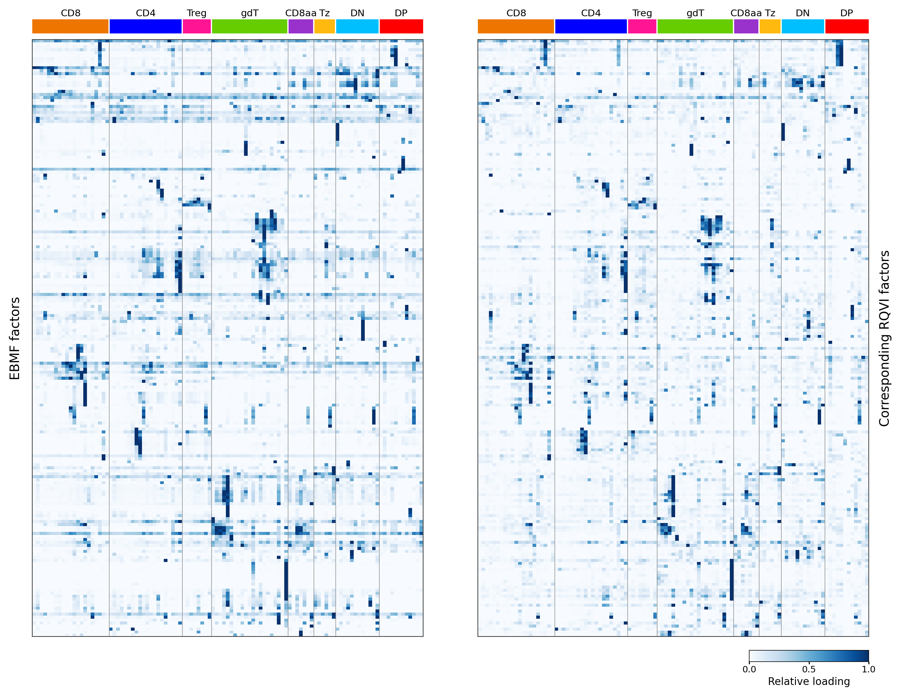

This page documents **Figure 8b**. The other panels of Figure 8 (A nonlinear
deep-learning framework independently recovers the immgenT gene-program
landscape) are produced by the RQVI framework and are documented in the
companion repository for RQVI.

Figure 8b asks whether the fine-grained cluster-level patterns captured by the
200 EBMF GPs are recovered by an independent factorization. It compares each EBMF
GP with a matched RQVI GP -- RQVI being an alternative matrix factorization of
the same cells, run across 10 random-seed initializations (256 GPs per seed). The
two heatmaps share the same row and column order and use a white-to-blue scale of
per-GP relative loading on `[0, 1]`, with broad lineage annotations above the
columns.

Cells are the `L_pm_filtered` GP loadings (cells passing the iterative
total-loading filter), restricted to non-thymocytes (`annotation_level1 !=
"thymocyte"`, all conditions) and to cells that also carry an RQVI loading. EBMF
and RQVI loadings are averaged within `annotation_level2` on these common cells,
and each RQVI GP is shown on the row of its matched EBMF GP. In the code and in
the intermediate files the EBMF GPs are named F1-F200; those are GP1-GP200.

## Figure 8b {#fig8b}

```{r fig8b-img, echo=FALSE, out.width="100%"}

```

::: {.figcaption}
**Fig. 8b.** Cluster-level activity profiles of corresponding EBMF and RQVI
GPs. EBMF cell loadings (left) and matched RQVI program loadings (right) were
averaged within the 107 level-2 clusters.
:::

## How the figure is made

Three steps, run from the repository root:

```bash
Rscript script/Figure8b.R          # cluster-mean matrices + column/palette metadata
python  script/Figure8b_rematch.py # one-to-one EBMF-RQVI program matching
python  script/Figure8b_plot.py    # heatmaps
```

The Python steps require `matplotlib`, `pandas`, `scipy`, `h5py`, and `numpy`.
The RQVI cell-level loadings are read as input from `data/`, which is a
git-ignored symlink and is not tracked here.

### Cluster means

`script/Figure8b.R` builds the raw `annotation_level2` cluster-mean matrix for the
EBMF GPs on the common non-thymocyte cells, together with the column order
(Figure-1 level1 lineage order, alphabetical within each lineage) and the lineage
color palette. The matched RQVI cluster means are produced by the matching step
below.

```{r fig8b-data, code=readLines("../script/Figure8b.R"), eval=FALSE}
```

### Matching

Each GP's mean-loading profile is z-scored across clusters; the signed
Pearson correlation between every EBMF GP and all 2,560 candidate RQVI
GPs is computed; candidates with a constant profile are excluded; and a
maximum-weight one-to-one assignment (`scipy.optimize.linear_sum_assignment`)
matches each EBMF GP to a distinct RQVI GP so that the total signed
correlation is maximized. The assignment is computed over all common cells (108
`annotation_level2` clusters); the figure displays the 107 non-thymocyte
clusters. The median per-GP correlation is 0.766, with 92.5% at r >= 0.5.
Code:
[`script/Figure8b_rematch.py`](https://github.com/AgueroZZ/immgenT-GP-analysis/blob/main/script/Figure8b_rematch.py).

### Plotting

`script/Figure8b_plot.py` orders the EBMF rows by hierarchical clustering (average
linkage, correlation distance, optimal leaf ordering), rescales every GP to
`[0, 1]` across clusters, and draws the two heatmaps with a shared colorbar; the
matched RQVI panel reuses the EBMF row order. The published PDF and the PNG this
page shows come out of the same matplotlib figure in one call, so the two cannot
drift apart. Code:
[`script/Figure8b_plot.py`](https://github.com/AgueroZZ/immgenT-GP-analysis/blob/main/script/Figure8b_plot.py).
