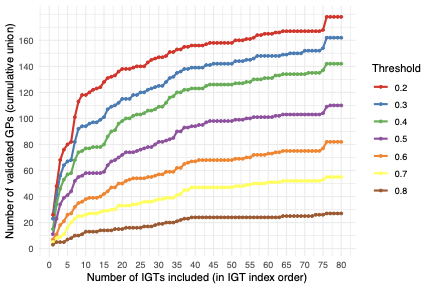
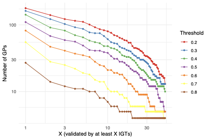
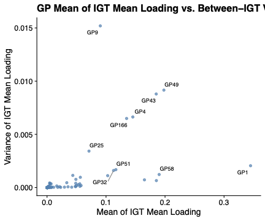
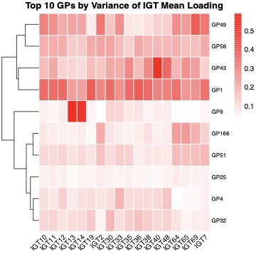
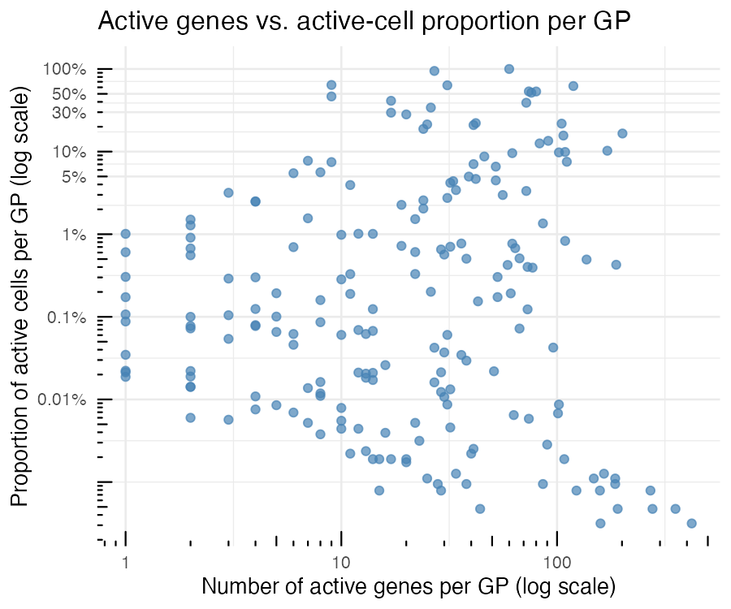

All panels are produced by
[`script/FigureS1.R`](https://github.com/AgueroZZ/immgenT-GP-analysis/blob/main/script/FigureS1.R).
The code below is shown for reference (not re-executed on this page); the
images are its pre-rendered output. Panels A/B reuse a cached per-IGT
cosine-similarity score matrix (`data/igt_specific_cosine_scores.csv`); see
`code/pipeline/05_igt_validation.R` for how that matrix itself is
produced (a much heavier, cluster-scale computation).

## Setup

```{r figs1-setup, code=readLines("../script/FigureS1.R")[1:37], eval=FALSE}
```

Panels A and B both use the cached per-IGT cosine score matrix:

```{r figs1-setup-ab, code=readLines("../script/FigureS1.R")[39:43], eval=FALSE}
```

## (A) Cumulative GPs validated as IGTs are added {#figs1a}

```{r figs1a-code, code=readLines("../script/FigureS1.R")[66:91], eval=FALSE}
```

```{r figs1a-img, echo=FALSE, out.width="49%"}

```

::: {.figcaption}
**Fig. S1A.** GPs were tested for reproducibility in individual datasets (IGTs): for each IGT a dataset-specific EBMF factorization was computed and its factors were matched to the global GPs by Hungarian assignment on the cosine similarity of gene-score vectors (restricted to shared genes, with columns scaled), and a GP is counted as "validated" in an IGT when this cosine similarity reaches a given threshold. Adding IGTs one at a time in index order, the curves show the cumulative number of GPs (of 200) validated in at least one IGT included so far, for cosine thresholds of 0.2-0.8.
:::

## (B) GPs validated by at least X IGTs {#figs1b}

```{r figs1b-code, code=readLines("../script/FigureS1.R")[45:64], eval=FALSE}
```

```{r figs1b-img, echo=FALSE, out.width="49%"}

```

::: {.figcaption}
**Fig. S1B.** Using the same per-IGT cosine matching, the number of GPs validated by at least X IGTs as a function of X (both axes log-scaled), for thresholds of 0.2-0.8.
:::

## (C) Between-IGT variability {#figs1c}

```{r figs1c-setup, code=readLines("../script/FigureS1.R")[93:101], eval=FALSE}
```

```{r figs1c-code, code=readLines("../script/FigureS1.R")[103:127], eval=FALSE}
```

```{r figs1c-img, echo=FALSE, out.width="49%"}

```

::: {.figcaption}
**Fig. S1C.** Between-IGT variability of GP loadings, computed on a standard spleen subset used for this purpose. Each GP's mean loading is computed within every IGT; each point is a GP, plotting the mean across IGTs of these per-IGT mean loadings (x-axis) against their variance across IGTs (y-axis). The ten GPs with the highest between-IGT variance are labeled.
:::

## (D) Top-variance GP heatmap {#figs1d}

```{r figs1d-code, code=readLines("../script/FigureS1.R")[129:160], eval=FALSE}
```

```{r figs1d-img, echo=FALSE, out.width="49%"}

```

::: {.figcaption}
**Fig. S1D.** Heatmap of the per-IGT mean loading (same standard spleen subset, restricted to IGTs with >= 500 cells) for the ten GPs with the highest between-IGT variance from (C). Rows (GPs) are hierarchically clustered; color runs from white (low) to red (high mean loading).
:::

## (E) Active-gene vs. active-cell proportion per GP {#figs1e}

```{r figs1e-code, code=readLines("../script/FigureS1.R")[165:194], eval=FALSE}
```

```{r figs1e-img, echo=FALSE, out.width="60%"}

```

::: {.figcaption}
**Fig. S1E.** For each GP, the number of active genes (x-axis) versus the proportion of active cells (y-axis), using the same hard-threshold definitions as Figure 2: a gene is active in a GP if its per-GP-normalized score exceeds 0.25 in absolute value, and a cell is active if its per-GP-normalized loading exceeds 0.1; computed over non-thymocyte cells. Both axes on log scale; each dot is one of the 200 GPs.
:::
