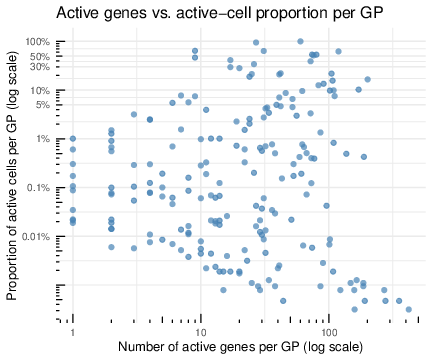

```{r doc-code, include=FALSE}
source("../code/R/doc_code.R")
```

Published as **Extended Data Figure 1**.

All panels are produced by
[`script/FigureS1.R`](https://github.com/AgueroZZ/immgenT-GP-analysis/blob/main/script/FigureS1.R).
The code below is shown for reference (not re-executed on this page); the
images are its pre-rendered output. Panels A/B reuse a cached per-IGT
cosine-similarity score matrix (`data/igt_specific_cosine_scores.csv`); see
`code/pipeline/05_igt_validation.R` for how that matrix itself is
produced (a much heavier, cluster-scale computation).

## Setup

```{r figs1-setup, code=code_for("../script/FigureS1.R", "^"), eval=FALSE}
```

Panels A and B both use the cached per-IGT cosine score matrix:

```{r figs1-setup-ab, code=code_for("../script/FigureS1.R", c("doc:setup-ab", "S1A/S1B")), eval=FALSE}
```

## (A) Cumulative GPs validated as IGTs are added {#figs1a}

```{r figs1a-code, code=code_for("../script/FigureS1.R", "S1A:"), eval=FALSE}
```

```{r figs1a-img, echo=FALSE, out.width="49%"}
knitr::include_graphics("assets/FigureS1/S1A.png")
```

::: {.figcaption}
**Fig. S1A.** Cumulative number of GPs, out of the 200 identified in the full immgenT solution, reproduced in at least one dataset (IGT). For each dataset an EBMF factorization was computed and its factors were matched to the 200 immgenT GPs by Hungarian assignment using the cosine similarity of gene-score vectors (restricted to shared genes, with columns scaled); a GP was considered reproduced in a dataset when this cosine similarity exceeded the threshold indicated for each curve. Adding IGTs one at a time in index order, the curves show the cumulative count for cosine-similarity thresholds of 0.2-0.8.
:::

## (B) GPs validated by at least X IGTs {#figs1b}

```{r figs1b-code, code=code_for("../script/FigureS1.R", "S1B:"), eval=FALSE}
```

```{r figs1b-img, echo=FALSE, out.width="49%"}
knitr::include_graphics("assets/FigureS1/S1B.png")
```

::: {.figcaption}
**Fig. S1B.** Distribution of GP reproducibility across datasets. Using the same per-IGT cosine matching, the curves show the number of GPs reproduced in at least that many datasets, for cosine-similarity thresholds ranging from 0.2 to 0.8 (both axes log-scaled).
:::

## (C) Variance explained by dataset vs. by cell type {#figs1c}

```{r figs1c-setup, code=code_for("../script/FigureS1.R", "Load data for S1C/S1D/S1E"), eval=FALSE}
```

```{r figs1c-code, code=code_for("../script/FigureS1.R", "S1C"), eval=FALSE}
```

```{r figs1c-img, echo=FALSE, out.width="60%"}
knitr::include_graphics("assets/FigureS1/S1C.png")
```

::: {.figcaption}
**Fig. S1C.** Batch-effect evaluation using the spleen standards spiked into each
dataset (IGT). For each GP, the proportion of loading variance explained by
dataset (x-axis) is plotted against the proportion explained by cell type
(`annotation_level2`, y-axis), both computed over the same 47,253
spleen-standard cells (35 datasets, 102 cell types) as the one-way ANOVA
$\eta^2 = \mathrm{SS_{between}}/\mathrm{SS_{total}}$, where each group's
contribution is weighted by its cell count. Each point is one of the 200 GPs;
the twelve highest on each axis are labeled. The dashed line is $y = x$; the two
dotted guides mark five times the null expectation $(G-1)/(N-1)$ of $\eta^2$
under no group effect, which differs between axes because the two groupings have
different numbers of groups. Most GPs sit near the origin, i.e. are explained by
neither; the GPs that separate do so along one axis or the other, with only GP32
close to $y = x$.
:::

## (D) GP9 loading across datasets {#figs1d}

```{r figs1d-code, code=code_for("../script/FigureS1.R", "S1D"), eval=FALSE}
```

```{r figs1d-img, echo=FALSE, out.width="52%"}
knitr::include_graphics("assets/FigureS1/S1D.png")
```

::: {.figcaption}
**Fig. S1D.** The extreme point on (C)'s x-axis, shown directly: the distribution
of GP9 loading in spleen-standard cells of each dataset, for the 31 datasets
contributing at least 100 such cells, ordered by median loading. GP9 is elevated
in IGT13 and IGT14 (medians 0.60 and 0.56) and uniformly low in every other
dataset (medians 0.02-0.12), which is what a
dataset-specific -- rather than cell-type-specific -- program looks like.
:::

## (E) GP9 loading per sample within IGT13/IGT14 {#figs1e}

```{r figs1e-code, code=code_for("../script/FigureS1.R", "S1E"), eval=FALSE}
```

```{r figs1e-img, echo=FALSE, out.width="70%"}
knitr::include_graphics("assets/FigureS1/S1E.png")
```

::: {.figcaption}
**Fig. S1E.** The same GP9 loading, split into the individual samples that make up
the two datasets from (D). IGT13 and IGT14 are two runs of the same two
hashed mice (mouse0021, male, HT1; mouse0022, female, HT9), giving four samples;
GP9 is elevated in all four (sample means 0.544-0.606) rather than in a single
aberrant mouse or a single run. The dashed line marks the mean over the other 33
spleen-standard datasets (0.057).
:::

## (F) Active-gene vs. active-cell proportion per GP {#figs1f}

```{r figs1f-code, code=code_for("../script/FigureS1.R", "S1F"), eval=FALSE}
```

```{r figs1f-img, echo=FALSE, out.width="60%"}

```

::: {.figcaption}
**Fig. S1F.** For each GP, the number of active genes (x-axis) versus the fraction of active cells (y-axis), using the same thresholds as Figure 2: a gene is active in a GP if its per-GP-normalized score exceeds 0.25 in absolute value, and a cell is active if its per-GP-normalized loading exceeds 0.1; computed over non-thymocyte cells. Both axes on log scale; each dot is one of the 200 GPs. (Was panel E before 2026-07-30; content unchanged.)
:::
