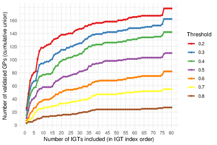
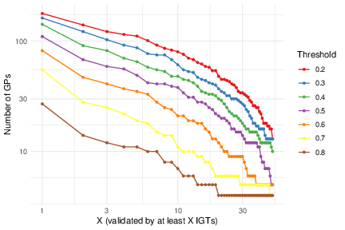
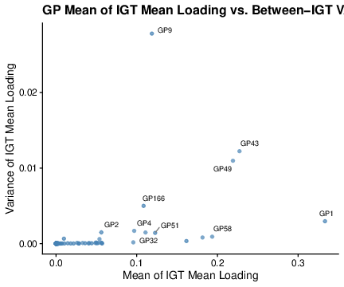
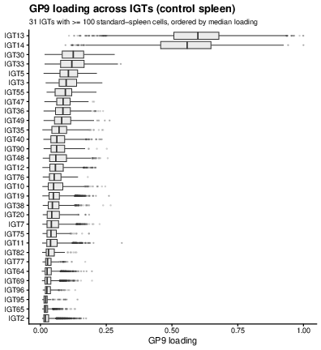

```{r doc-code, include=FALSE}
source("../code/R/doc_code.R")
```

Published as **Extended Data Figure 1**.

All panels are produced by
[`script/FigureS1.R`](https://github.com/AgueroZZ/immgenT-GP-analysis/blob/main/script/FigureS1.R).
The code below is shown for reference (not re-executed on this page); the
images are its pre-rendered output. Panels A/B reuse a cached per-IGT
cosine-similarity score matrix (`data/igt_specific_cosine_scores.csv`); see
`code/pipeline/05_igt_validation.R` for how that matrix itself is
produced (a much heavier, cluster-scale computation).

## Setup

```{r figs1-setup, code=code_for("../script/FigureS1.R", "^"), eval=FALSE}
```

Panels A and B both use the cached per-IGT cosine score matrix:

```{r figs1-setup-ab, code=code_for("../script/FigureS1.R", c("doc:setup-ab", "S1A/S1B")), eval=FALSE}
```

## (A) Cumulative GPs validated as IGTs are added {#figs1a}

```{r figs1a-code, code=code_for("../script/FigureS1.R", "S1A:"), eval=FALSE}
```

```{r figs1a-img, echo=FALSE, out.width="49%"}

```

::: {.figcaption}
**Fig. S1A.** Cumulative number of GPs, out of the 200 identified in the full immgenT solution, reproduced in at least one dataset (IGT). For each dataset an EBMF factorization was computed and its factors were matched to the 200 immgenT GPs by Hungarian assignment using the cosine similarity of gene-score vectors (restricted to shared genes, with columns scaled); a GP was considered reproduced in a dataset when this cosine similarity exceeded the threshold indicated for each curve. Adding IGTs one at a time in index order, the curves show the cumulative count for cosine-similarity thresholds of 0.2-0.8.
:::

## (B) GPs validated by at least X IGTs {#figs1b}

```{r figs1b-code, code=code_for("../script/FigureS1.R", "S1B:"), eval=FALSE}
```

```{r figs1b-img, echo=FALSE, out.width="49%"}

```

::: {.figcaption}
**Fig. S1B.** Distribution of GP reproducibility across datasets. Using the same per-IGT cosine matching, the curves show the number of GPs reproduced in at least that many datasets, for cosine-similarity thresholds ranging from 0.2 to 0.8 (both axes log-scaled).
:::

## (C) Between-IGT variability {#figs1c}

```{r figs1c-setup, code=code_for("../script/FigureS1.R", "Load data for S1C/S1D"), eval=FALSE}
```

```{r figs1c-code, code=code_for("../script/FigureS1.R", "S1C"), eval=FALSE}
```

```{r figs1c-img, echo=FALSE, out.width="49%"}

```

::: {.figcaption}
**Fig. S1C.** Batch-effect evaluation using the spleen standards spiked into each
dataset (IGT): variance versus mean GP loading across datasets, considering only
spleen-standard cells, in the **18 datasets** contributing at least 500 such cells
-- so that no per-IGT mean rests on a handful of cells. Each GP's mean loading is
computed within every one of those 18 IGTs; each point is a GP, plotting the mean
across IGTs of these per-IGT mean loadings (x-axis) against their variance across
IGTs (y-axis). The ten GPs with the highest between-dataset variance are labeled,
and are the ten shown in (D).
:::

## (D) Top-variance GP heatmap {#figs1d}

```{r figs1d-code, code=code_for("../script/FigureS1.R", "S1D"), eval=FALSE}
```

```{r figs1d-img, echo=FALSE, out.width="49%"}

```

::: {.figcaption}
**Fig. S1D.** Heatmap showing the mean loading of these same ten GPs across the same 18 datasets -- the same ten GPs labelled in (C), over the same IGTs, from the same matrix. Rows (GPs) are hierarchically clustered; color runs from white (low) to red (high mean loading).
:::

## (E) Active-gene vs. active-cell proportion per GP {#figs1e}

```{r figs1e-code, code=code_for("../script/FigureS1.R", "S1E"), eval=FALSE}
```

```{r figs1e-img, echo=FALSE, out.width="60%"}
knitr::include_graphics("assets/FigureS1/S1E.png")
```

::: {.figcaption}
**Fig. S1E.** For each GP, the number of active genes (x-axis) versus the fraction of active cells (y-axis), using the same thresholds as Figure 2: a gene is active in a GP if its per-GP-normalized score exceeds 0.25 in absolute value, and a cell is active if its per-GP-normalized loading exceeds 0.1; computed over non-thymocyte cells. Both axes on log scale; each dot is one of the 200 GPs.
:::
