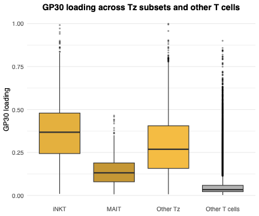
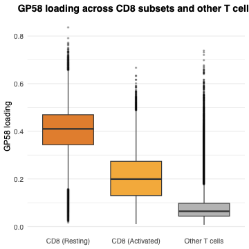
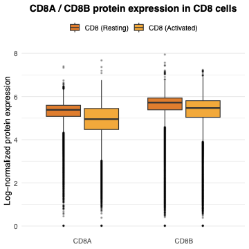

All panels are produced by
[`script/FigureS2.R`](https://github.com/AgueroZZ/immgenT-GP-analysis/blob/main/script/FigureS2.R),
which shares its source data setup with [Figure 2](Figure2.html). The code
below is shown for reference (not re-executed on this page); the images are
its pre-rendered output.

## Setup

```{r figs2-setup, code=readLines("../script/FigureS2.R")[1:41], eval=FALSE}
```

## (A) GP30 loading across Tz subsets {#figs2a}

```{r figs2a-code, code=readLines("../script/FigureS2.R")[43:70], eval=FALSE}
```

```{r figs2a-img, echo=FALSE, out.width="32%"}

```

::: {.figcaption}
**Fig. S2A.** Boxplots of GP30 loading across Tz subsets -- iNKT, MAIT, and other Tz (Tz cells that are neither iNKT nor MAIT) -- and all other, non-Tz T cells; thymocytes are excluded. Boxes show the median and interquartile range, whiskers extend to 1.5x the interquartile range, and points mark values beyond the whiskers.
:::

## (B) GP58 loading, resting/activated CD8 {#figs2b}

```{r figs2b-code, code=readLines("../script/FigureS2.R")[72:100], eval=FALSE}
```

```{r figs2b-img, echo=FALSE, out.width="32%"}

```

::: {.figcaption}
**Fig. S2B.** Boxplots of GP58 loading in resting CD8, activated CD8 (split by activation annotation), and the other six T-cell lineages pooled as "Other T cells" (CD4, Treg, gdT, CD8aa, Tz, and DN; thymocytes and DP cells are excluded); boxes and outlier points as in (A).
:::

## (C) CD8A/CD8B protein expression {#figs2c}

```{r figs2c-code, code=readLines("../script/FigureS2.R")[102:136], eval=FALSE}
```

```{r figs2c-img, echo=FALSE, out.width="32%"}

```

::: {.figcaption}
**Fig. S2C.** Boxplots of CD8A and CD8B log-normalized surface-protein (CITE-seq) expression in CD8 cells, comparing resting versus activated, restricted to CD8 cells with CITE-seq protein measurements; boxes and outlier points as in (A).
:::
