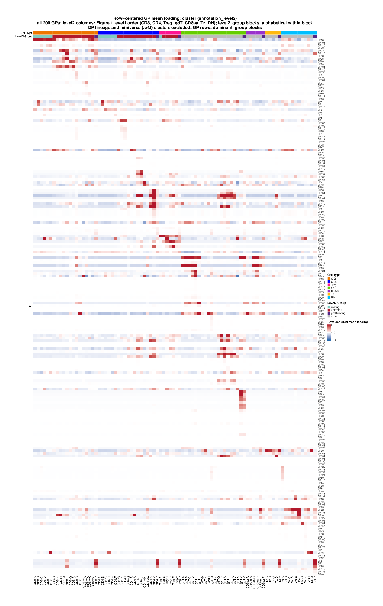

```{r doc-code, include=FALSE}
source("../code/R/doc_code.R")
```

Panels (a)-(c) are produced by
[`script/FigureS2.R`](https://github.com/AgueroZZ/immgenT-GP-analysis/blob/main/script/FigureS2.R)
and panel (d) by
[`script/FigureS2d.R`](https://github.com/AgueroZZ/immgenT-GP-analysis/blob/main/script/FigureS2d.R).
The code below is shown for reference; the images are its pre-rendered output.

## Setup

```{r figs2-setup, code=code_for("../script/FigureS2.R", c("^", "Load data")), eval=FALSE}
```

## (a) GP30 loading across Tz subsets {#figs2a}

```{r figs2a-code, code=code_for("../script/FigureS2.R", "S2A"), eval=FALSE}
```

```{r figs2a-img, echo=FALSE, out.width="32%"}
knitr::include_graphics("assets/FigureS2/S2A.png")
```

::: {.figcaption}
**Extended Data Fig. 2a.** Box plots showing the distribution of GP30 activity
across Tz subsets—iNKT, MAIT, and other Tz cells (that is, Tz cells that are
neither iNKT nor MAIT)—and all other T cells.
:::

## (b) GP58 loading, resting/activated CD8 {#figs2b}

```{r figs2b-code, code=code_for("../script/FigureS2.R", "S2B"), eval=FALSE}
```

```{r figs2b-img, echo=FALSE, out.width="32%"}
knitr::include_graphics("assets/FigureS2/S2B.png")
```

::: {.figcaption}
**Extended Data Fig. 2b.** Box plots showing GP58 activity in resting and
activated CD8+ T cells compared with all other T cells.
:::

## (c) CD8A/CD8B protein expression {#figs2c}

```{r figs2c-code, code=code_for("../script/FigureS2.R", "S2C"), eval=FALSE}
```

```{r figs2c-img, echo=FALSE, out.width="32%"}
knitr::include_graphics("assets/FigureS2/S2C.png")
```

::: {.figcaption}
**Extended Data Fig. 2c.** Box plots of CD8A and CD8B protein expression
(CITE-seq, log-normalized counts) in resting and activated CD8+ T cells.
:::

## (d) GP activity across T cell clusters {#figs2d}

The mean-loading counterpart of [Figure 4](Figure4.html), which resolves the
same clusters cell by cell.

### Setup, centering, and ordering

```{r figs2d-setup, code=code_for("../script/FigureS2d.R", c("^", "Setup, centering")), eval=FALSE}
```

### Cluster mean loading

```{r figs2d-code, code=code_for("../script/FigureS2d.R", "doc:rendering"), eval=FALSE}
```

```{r figs2d-img, echo=FALSE, out.width="100%"}

```

::: {.figcaption}
**Extended Data Fig. 2d.** Row-centered mean GP activity across the 88
level-2 clusters. Mean GP activity computed in samples at baseline.
:::
