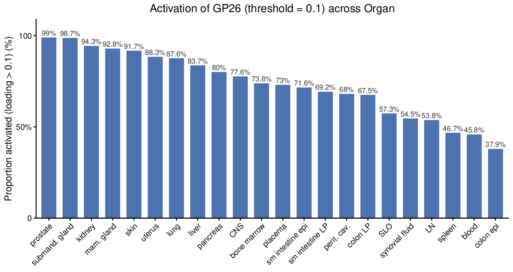
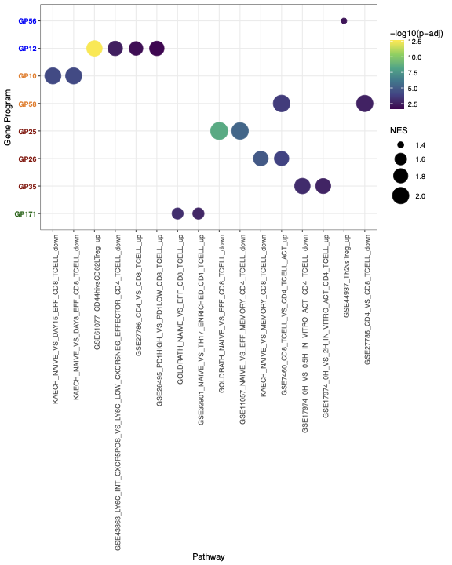
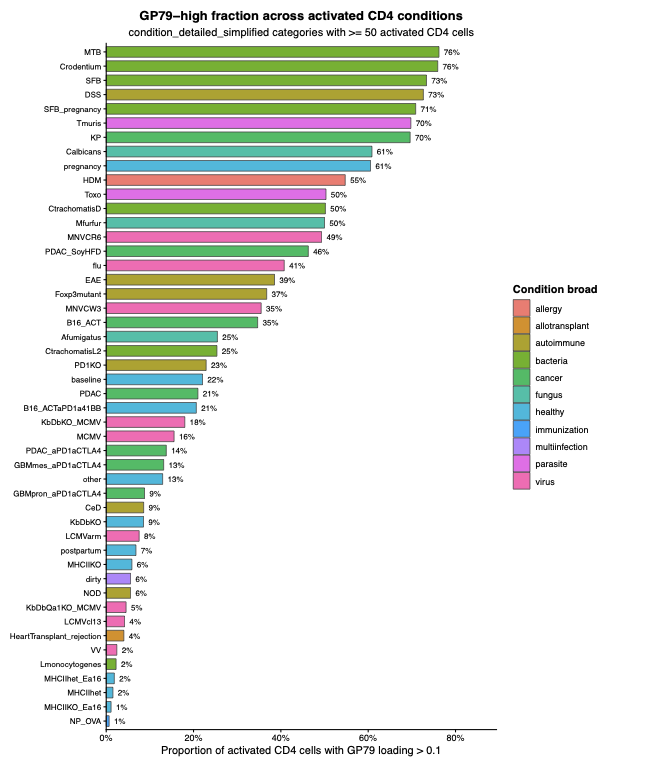
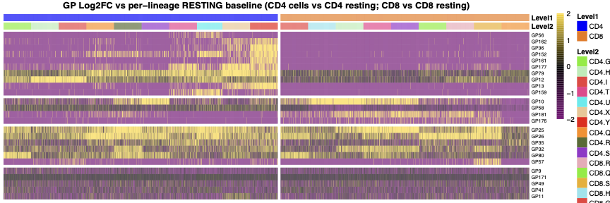
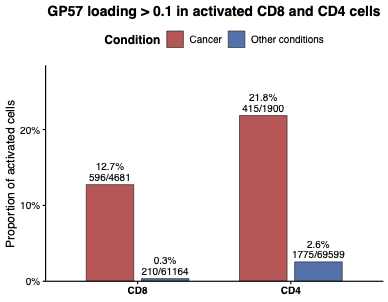
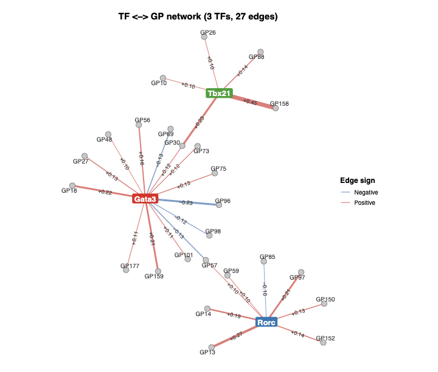

All panels are produced by
[`script/FigureS3.R`](https://github.com/AgueroZZ/immgenT-GP-analysis/blob/main/script/FigureS3.R),
which shares its curated GP set with [Figure 3](Figure3.html) via
`code/R/activation_shared_setup.R`. The code below is shown for
reference (not re-executed on this page); the images are its pre-rendered
output.

## Setup

```{r figs3-setup, code=readLines("../script/FigureS3.R")[1:46], eval=FALSE}
```

## (s3c) GP26+ rate by organ {#figs3c}

```{r figs3c-code, code=readLines("../script/FigureS3.R")[48:69], eval=FALSE}
```

```{r figs3c-img, echo=FALSE, out.width="32%"}

```

::: {.figcaption}
**Fig. S3c.** Bar plot of the fraction of cells in each organ (organ_simplified) with GP26 loading above 0.2, sorted from highest to lowest.
:::

## (s3d) GSEA dot plot {#figs3d}

```{r figs3d-code, code=readLines("../script/FigureS3.R")[71:90], eval=FALSE}
```

```{r figs3d-img, echo=FALSE, out.width="32%"}

```

::: {.figcaption}
**Fig. S3d.** GSEA dot plot relating the activation GPs to curated immunologic signature gene sets. Each dot is a significant GP-gene-set association; color denotes -log10 adjusted p-value and size denotes the normalized enrichment score (NES). GP labels are colored by activation class.
:::

## (s3e) GP79+ rate across conditions {#figs3e}

```{r figs3e-code, code=readLines("../script/FigureS3.R")[131:184], eval=FALSE}
```

```{r figs3e-img, echo=FALSE, out.width="49%"}

```

::: {.figcaption}
**Fig. S3e.** Bar plot of the fraction of activated CD4 cells with GP79 loading above 0.1, across condition categories (condition_detailed_simplified) that contain >= 50 activated CD4 cells, sorted from highest to lowest and colored by broad condition category.
:::

## (s3f) Per-cell log2FC heatmap {#figs3f}

```{r figs3f-code, code=readLines("../script/FigureS3.R")[269:392], eval=FALSE}
```

```{r figs3f-img, echo=FALSE, out.width="100%"}

```

::: {.figcaption}
**Fig. S3f.** Heatmap of per-cell log2 fold-change in GP loading relative to the resting baseline of the same lineage (each activated CD4 cell versus the CD4 resting mean; each activated CD8 cell versus the CD8 resting mean), capped at +-2. Rows are the activation GPs in semantic-group order; columns are individual activated cells grouped by sub-lineage (Level-2) within CD4 and CD8; color runs from purple (low) through black to gold (high).
:::

## (s3g) GP57+ rate, cancer vs. other conditions {#figs3g}

```{r figs3g-code, code=readLines("../script/FigureS3.R")[92:129], eval=FALSE}
```

```{r figs3g-img, echo=FALSE, out.width="49%"}

```

::: {.figcaption}
**Fig. S3g.** Fraction of activated CD8 and CD4 cells with GP57 loading above 0.1, comparing cancer conditions against all other conditions combined; bar labels give the percentage and the underlying cell counts.
:::

## (s3h) TF-GP network for Gata3/Rorc/Tbx21 {#figs3h}

```{r figs3h-code, code=readLines("../script/FigureS3.R")[186:267], eval=FALSE}
```

```{r figs3h-img, echo=FALSE, out.width="49%"}

```

::: {.figcaption}
**Fig. S3h.** Bipartite transcription factor (TF)-GP network for the lineage-defining TFs Gata3, Rorc, and Tbx21. An edge connects a TF to a GP when the TF's per-GP-normalized gene score has magnitude >= 0.1; edge color denotes sign (red, positive; blue, negative), width scales with magnitude, and labels give the signed score.
:::
