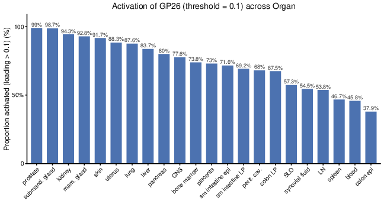
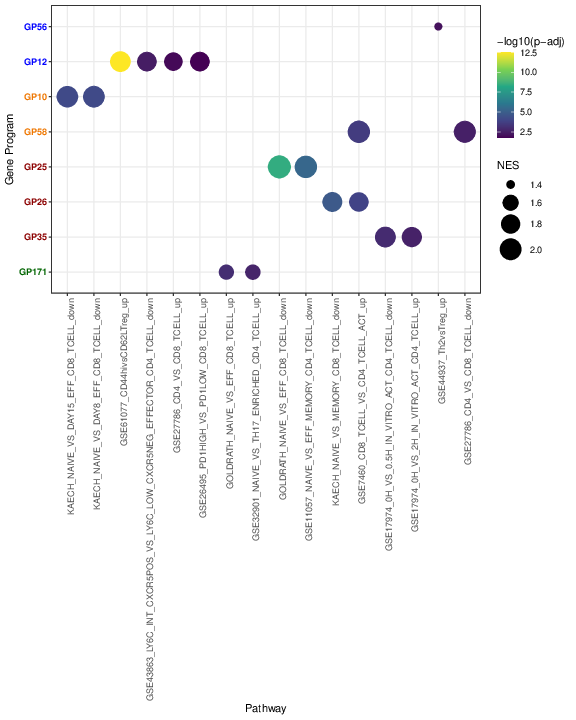
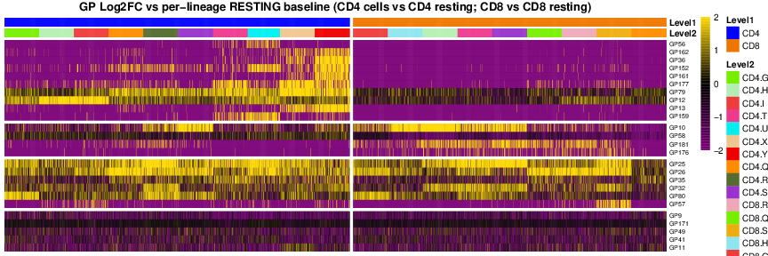
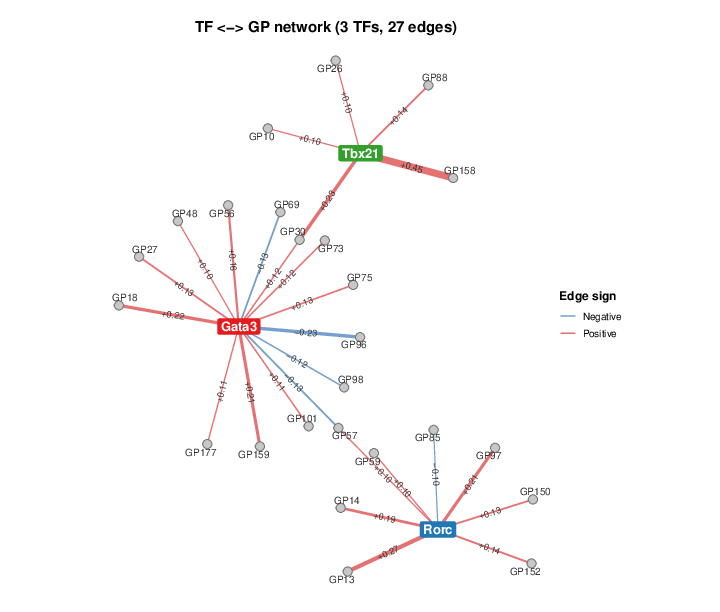

```{r doc-code, include=FALSE}
source("../code/R/doc_code.R")
```

Published as **Extended Data Figure 3**.

Panels (s3b)-(s3g) are produced by
[`script/FigureS3.R`](https://github.com/AgueroZZ/immgenT-GP-analysis/blob/main/script/FigureS3.R),
which shares its curated GP set with [Figure 4](Figure4.html) via
`code/R/activation_shared_setup.R`. The code below is shown for
reference (not re-executed on this page); the images are its pre-rendered
output.

Panel (s3a) is **not produced in this repository** -- see below.

**Lettering note.** The gate definition in (s3a) used to be split into two
panels, s3a (the MDEs) and s3b (the protein plot); they are one panel, so every
panel after it is now one letter lower than in the published figure --
s3b here is the published s3c, and s3g is the published s3h.

## Setup

```{r figs3-setup, code=code_for("../script/FigureS3.R", c("^", "Load data")), eval=FALSE}
```

## (s3a) Definition of resting and activated CD4/CD8 cells {#figs3a}

This panel is **missing from this site**: no code in `script/FigureS3.R`
produces it, and there is no `s3a` asset under `analysis/assets/FigureS3/`,
`figures/final-selected/Figure S3/`, or `figures/Previous/bits/`. The published
caption describes it as follows.

::: {.figcaption}
**Fig. S3a.** Definition of resting and activated CD4+ and CD8+ T cells.
Activated CD44+CD62L- (top) and resting CD62L+CD44- (bottom) cells are
highlighted in each lineage-specific MDE, and the gated cells are shown in the
adjacent CD62L versus CD44 protein-expression plot (CITE-seq; log-normalized ADT
counts).
:::

The `annotation_level2_group` "activated"/"resting" labels that every other panel
on this page (and all of [Figure 4](Figure4.html)) filters on are the labels this
panel defines, so the gate itself is already in use here -- only the figure
illustrating it is absent.

## (s3b) GP26+ rate by organ {#figs3b}

```{r figs3b-code, code=code_for("../script/FigureS3.R", "s3b"), eval=FALSE}
```

```{r figs3b-img, echo=FALSE, out.width="32%"}
knitr::include_graphics("assets/FigureS3/s3b.png")
```

::: {.figcaption}
**Fig. S3b.** Bar plot showing the percentage of **activated CD4+ and CD8+ T cells** in each organ (`organ_simplified`) with GP26 activity above **0.1**, sorted from highest to lowest. Activated cells are those with `annotation_level2_group == "activated"` among the CD4 and CD8 lineages.
:::

## (s3c) GSEA dot plot {#figs3c}

```{r figs3c-code, code=code_for("../script/FigureS3.R", "s3c"), eval=FALSE}
```

```{r figs3c-img, echo=FALSE, out.width="32%"}

```

::: {.figcaption}
**Fig. S3c.** Gene set enrichment analysis (GSEA) dot plot relating activation-associated GPs to curated immunologic signature gene sets. Each dot is a significant GP-gene-set association; color denotes -log10 adjusted *P* value and dot size denotes the normalized enrichment score (NES). GP labels are colored by activation class.
:::

## (s3d) GP79+ rate across conditions {#figs3d}

```{r figs3d-code, code=code_for("../script/FigureS3.R", "s3d"), eval=FALSE}
```

```{r figs3d-img, echo=FALSE, out.width="49%"}

```

::: {.figcaption}
**Fig. S3d.** Bar plot showing the percentage of GP79-active cells (GP79 activity above 0.1) among all activated CD4+ T cells across immunological challenges -- condition categories (`condition_detailed_simplified`) that contain >= 50 activated CD4 cells, sorted from highest to lowest and colored by broad condition category.
:::

## (s3e) Per-cell log2FC heatmap {#figs3e}

```{r figs3e-code, code=code_for("../script/FigureS3.R", "s3e"), eval=FALSE}
```

```{r figs3e-img, echo=FALSE, out.width="100%"}

```

::: {.figcaption}
**Fig. S3e.** Heatmap showing single-cell GP activity in activated CD4+ and CD8+ T cells: per-cell log2 fold change in GP activity relative to the resting baseline of the same lineage (each activated CD4 cell versus the CD4 resting mean; each activated CD8 cell versus the CD8 resting mean), capped at +-2. Rows are the activation-associated GPs in semantic-group order; columns are individual activated cells grouped by cluster (Level-2 sub-lineage) within CD4 and CD8; color runs from purple (low) through black to gold (high).
:::

## (s3f) GP57+ rate, cancer vs. other conditions {#figs3f}

```{r figs3f-code, code=code_for("../script/FigureS3.R", "s3f"), eval=FALSE}
```

```{r figs3f-img, echo=FALSE, out.width="49%"}
knitr::include_graphics("assets/FigureS3/s3f.png")
```

::: {.figcaption}
**Fig. S3f.** Bar plot showing the percentage of GP57-active cells (GP57 activity above 0.1) among activated CD8+ and CD4+ T cells in cancer versus all other conditions combined; bar labels give the percentage and the underlying cell counts.
:::

## (s3g) TF-GP network for Gata3/Rorc/Tbx21 {#figs3g}

```{r figs3g-code, code=code_for("../script/FigureS3.R", "s3g"), eval=FALSE}
```

```{r figs3g-img, echo=FALSE, out.width="49%"}

```

::: {.figcaption}
**Fig. S3g.** GP network centered on the lineage-defining TFs Gata3, Rorc, and Tbx21. An edge connects a TF to a GP when the TF's per-GP absolute gene score is >= 0.1; edges are colored by the sign of the score (red, up-regulated; blue, down-regulated), edge width is proportional to the score, and labels give the signed score.
:::
