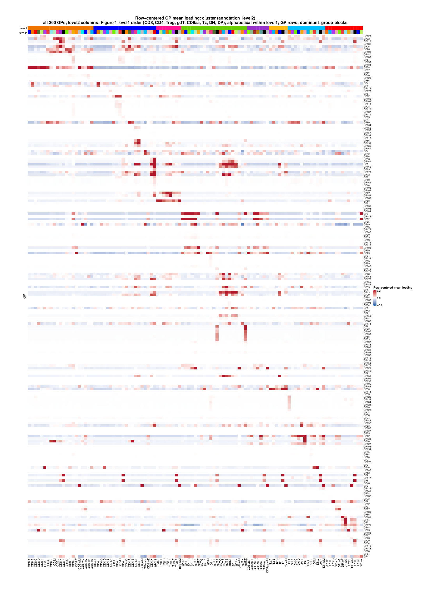

```{r doc-code, include=FALSE}
source("../code/R/doc_code.R")
```

This single-panel figure is produced by
[`script/FigureS3.R`](https://github.com/AgueroZZ/immgenT-GP-analysis/blob/main/script/FigureS3.R).
It shows the final full row-centered matrix, with all 200 GPs and all 107
observed level-2 clusters. The analysis uses healthy non-thymocyte cells
(`condition_broad == "healthy"` and `annotation_level1 != "thymocyte"`). For
each GP, its mean loading across clusters is subtracted from every cluster
mean, so a row says where a program is more or less active than its own
average rather than how large its loading is. The centered color scale is
fixed at -0.2 to 0.2; values outside this range are saturated at the endpoint
colors. It is the cluster counterpart of
[Extended Data Figure 5](FigureS5.html), which shows the tissue-associated GPs
across tissues and lineages, and the mean-loading counterpart of
[Extended Data Figure 6](FigureS6.html), which resolves the same clusters cell
by cell.

## Setup, centering, and ordering

```{r figs3-setup, code=code_for("../script/FigureS3.R", c("^", "Setup, centering")), eval=FALSE}
```

## Cluster mean loading {#figs3}

```{r figs3-code, code=code_for("../script/FigureS3.R", "doc:rendering"), eval=FALSE}
```

```{r figs3-img, echo=FALSE, out.width="100%"}

```

::: {.figcaption}
**Extended Data Fig. 3.** Row-centered mean GP activity across the 107
level-2 clusters. Mean GP activity computed in samples at baseline.
:::
