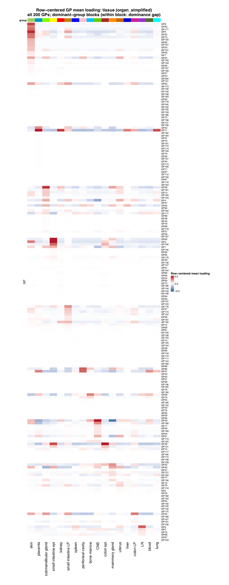
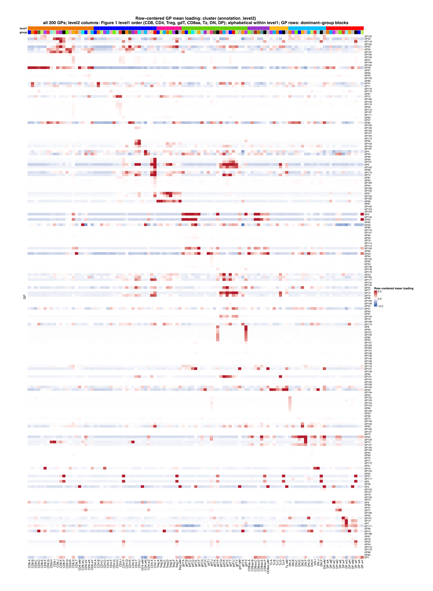

Figure S4 is produced by
[`script/FigureS4.R`](https://github.com/AgueroZZ/immgenT-GP-analysis/blob/main/script/FigureS4.R).
Both panels show the final full row-centered matrices, with all 200 GPs and all
observed groups. The analysis uses healthy non-thymocyte cells
(`condition_broad == "healthy"` and `annotation_level1 != "thymocyte"`). For
each GP, its mean loading across groups is subtracted from every group mean.
The shared centered color scale is fixed at -0.2 to 0.2; values outside this
range are saturated at the endpoint colors.

## Setup, centering, and ordering

```{r figs4-setup, code=readLines("../script/FigureS4.R")[1:261], eval=FALSE}
```

## (a) Tissue mean loading {#figs4a}

```{r figs4a-centered-img, echo=FALSE, out.width="100%"}

```

::: {.figcaption}
**Fig. S4a.** Row-centered mean GP loading across all 18
`organ_simplified` tissues for all 200 GPs. Each GP is assigned to the tissue
with its largest raw mean loading; tissues are ordered by their number of
dominant GPs, and GPs within each dominant-tissue block are ordered by
decreasing dominance gap. The centered color scale is fixed at -0.2 to 0.2.
:::

## (b) Level2 mean loading {#figs4b}

```{r figs4b-centered-img, echo=FALSE, out.width="100%"}

```

::: {.figcaption}
**Fig. S4b.** Row-centered mean GP loading across all 107
`annotation_level2` clusters for all 200 GPs. Columns follow the Figure 1
level1 sequence (`CD8`, `CD4`, `Treg`, `gdT`, `CD8aa`, `Tz`, `DN`, then `DP`)
and are alphabetized within each level1 block. GPs are arranged into
dominant-level2 blocks. The colored top strips show level1 and level2
annotations, and the centered color scale is fixed at -0.2 to 0.2.
:::

## Panel rendering

```{r figs4-rendering, code=readLines("../script/FigureS4.R")[262:309], eval=FALSE}
```
