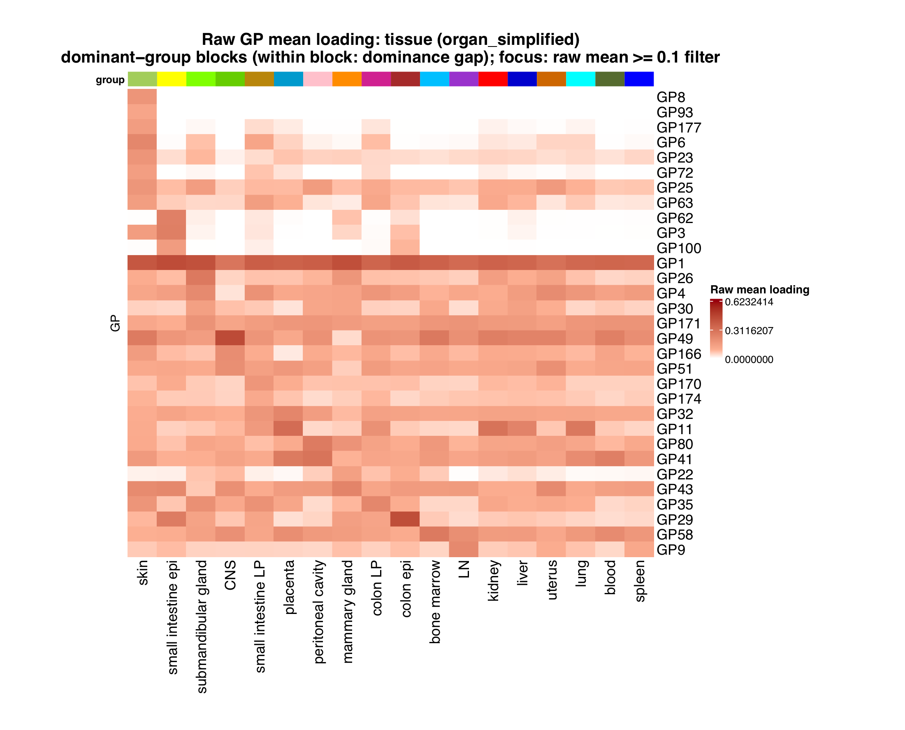
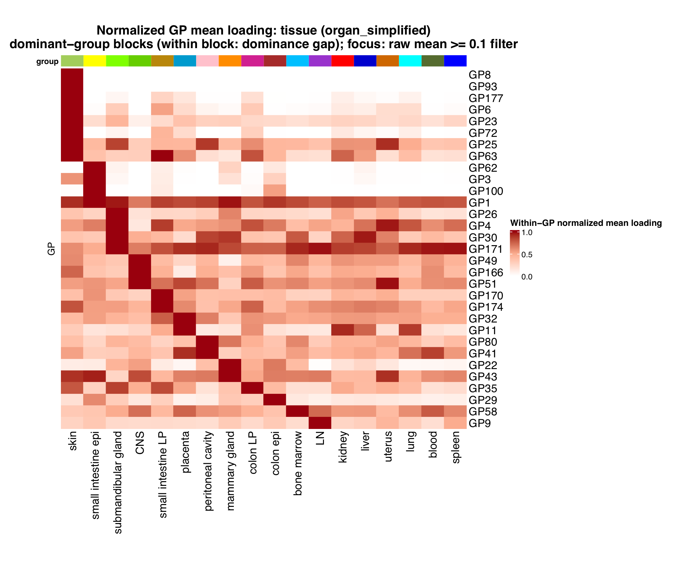
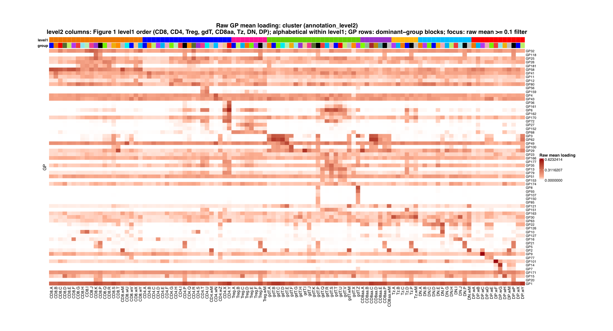
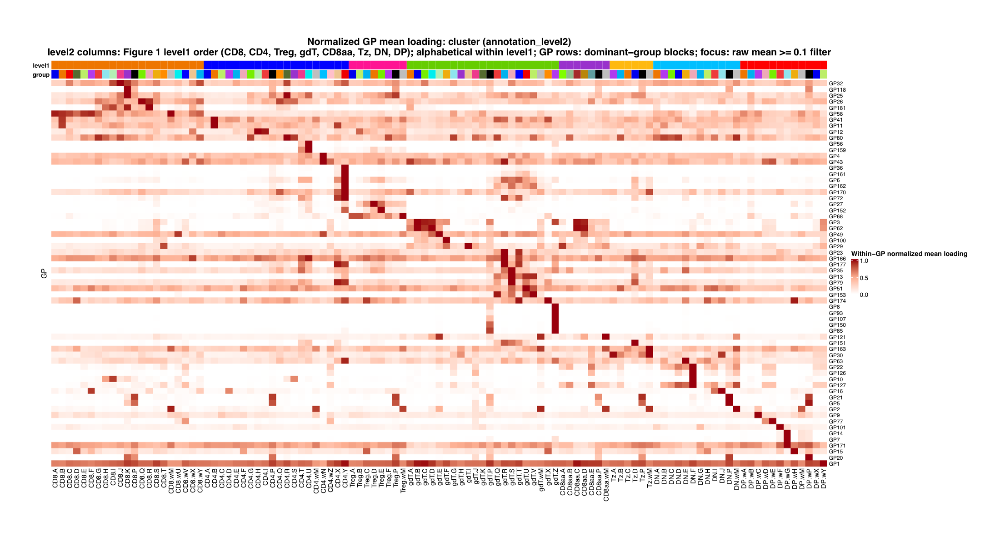

Figure S4 is produced by
[`script/FigureS4.R`](https://github.com/AgueroZZ/immgenT-GP-analysis/blob/main/script/FigureS4.R).
The page provides raw, within-GP-normalized, and row-centered alternatives as
clickable tabs for each panel; no display choice has been finalized. The code
is shown for reference and is not re-executed on this page. All panels use
healthy non-thymocyte cells (`condition_broad == "healthy"` and
`annotation_level1 != "thymocyte"`).

## Setup, filtering, and ordering

```{r figs4-setup, code=readLines("../script/FigureS4.R")[1:383], eval=FALSE}
```

## (a) Tissue mean loading {#figs4a .tabset}

The raw and normalized alternatives retain the same 31 GPs and 18
`organ_simplified` tissues. They use raw mean loading >= 0.1 for filtering and
a dominant-group order calculated on that filtered raw matrix. The centered
alternative is filtered independently after row-centering: it retains 70 GPs
and all 18 tissues. Rows and columns are kept when they contain at least one
centered mean loading >= 0.01.

### Raw mean loading

```{r figs4a-raw-img, echo=FALSE, out.width="100%"}

```

::: {.figcaption}
**Fig. S4a, raw alternative.** Mean GP loading across healthy non-thymocyte
tissues. Rows and columns follow dominant-group blocks: each GP is assigned to
the tissue with its largest raw mean loading; tissues are ordered by their
number of dominant GPs, and GPs within a block by dominance gap.
:::

### Within-GP normalized mean loading

```{r figs4a-normalized-img, echo=FALSE, out.width="100%"}

```

::: {.figcaption}
**Fig. S4a, normalized alternative.** The same retained GPs, tissues, and
dominant-group order as the raw view, with each GP divided by its largest raw
tissue mean before filtering. This view emphasizes relative tissue preference.
:::

### Row-centered mean loading

```{r figs4a-centered-img, echo=FALSE, out.width="100%"}
knitr::include_graphics("assets/FigureS4/S4a_centered_mean_loading.png")
```

::: {.figcaption}
**Fig. S4a, centered alternative.** For each GP, the mean loading across
tissues is subtracted from every tissue mean. Rows and columns are retained
independently when they contain at least one centered mean >= 0.01, then
arranged by a new dominant-group order. This cutoff retains GP37 and its
mammary-gland-specific signal.
:::

## (b) Level2 mean loading {#figs4b .tabset}

The raw and normalized alternatives retain the same 64 GPs and 107
`annotation_level2` clusters using raw mean loading >= 0.1. The centered
alternative is filtered independently after row-centering, retaining 112 GPs
and all 107 clusters. Rows and columns are kept when they contain at least one
centered mean loading >= 0.01.
For every level2 view, displayed columns are fixed to the Figure 1 level1
sequence (`CD8`, `CD4`, `Treg`, `gdT`, `CD8aa`, `Tz`, `DN`, then `DP`) and are
alphabetized within each level1 block. GPs are arranged into dominant-level2
blocks using the corresponding view's retained matrix. The colored top strips
show level1 and level2 annotations.

### Raw mean loading

```{r figs4b-raw-img, echo=FALSE, out.width="100%"}

```

::: {.figcaption}
**Fig. S4b, raw alternative.** Mean GP loading across healthy non-thymocyte
level2 clusters, with level2 columns grouped by the Figure 1 level1 order.
:::

### Within-GP normalized mean loading

```{r figs4b-normalized-img, echo=FALSE, out.width="100%"}

```

::: {.figcaption}
**Fig. S4b, normalized alternative.** The same retained GPs, level2 clusters,
and Figure 1 level1-first order as the raw view, with within-GP normalization
applied before filtering.
:::

### Row-centered mean loading

```{r figs4b-centered-img, echo=FALSE, out.width="100%"}
knitr::include_graphics("assets/FigureS4/S4b_centered_mean_loading.png")
```

::: {.figcaption}
**Fig. S4b, centered alternative.** For each GP, the mean loading across
level2 clusters is subtracted from every cluster mean. Rows and columns are
retained independently when they contain at least one centered mean >= 0.01;
retained level2 columns keep the Figure 1 level1-first order.
:::

## Panel rendering

```{r figs4-rendering, code=readLines("../script/FigureS4.R")[384:453], eval=FALSE}
```
