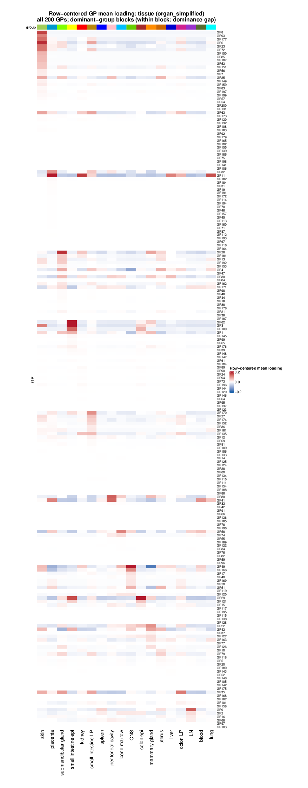
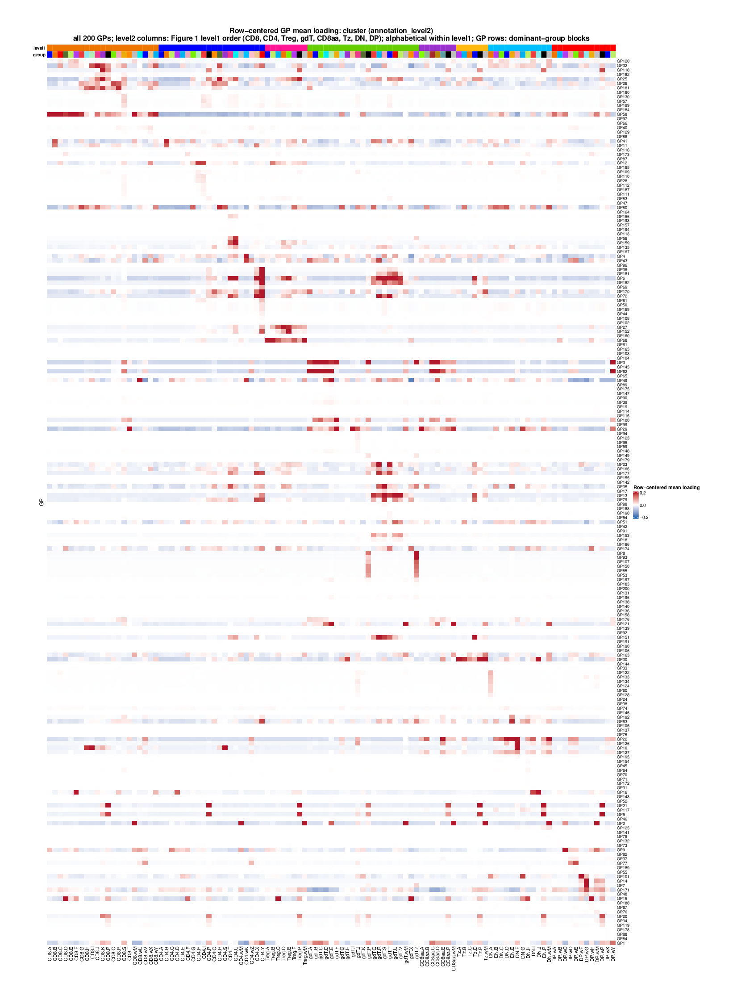

```{r doc-code, include=FALSE}
source("../code/R/doc_code.R")
```

Extended Data Figure 4 is produced by
[`script/FigureS4.R`](https://github.com/AgueroZZ/immgenT-GP-analysis/blob/main/script/FigureS4.R).
Both panels show the final full row-centered matrices, with all 200 GPs and all
observed groups. The analysis uses healthy non-thymocyte cells
(`condition_broad == "healthy"` and `annotation_level1 != "thymocyte"`). For
each GP, its mean loading across groups is subtracted from every group mean.
The shared centered color scale is fixed at -0.2 to 0.2; values outside this
range are saturated at the endpoint colors.

## Setup, centering, and ordering

```{r figs4-setup, code=code_for("../script/FigureS4.R", "^"), eval=FALSE}
```

## (a) Tissue mean loading {#figs4a}

```{r figs4a-centered-img, echo=FALSE, out.width="100%"}

```

::: {.figcaption}
**Extended Data Fig. 4a.** Row-centered mean GP activity across the 18
`organ_simplified` tissues for all 200 GPs. Each GP is assigned to the tissue
with its largest raw mean activity; tissues are ordered by their number of
assigned GPs, and GPs are grouped by assigned tissue -- within each block,
ordered by decreasing dominance gap. The centered color scale is fixed at
-0.2 to 0.2.
:::

## (b) Level2 mean loading {#figs4b}

```{r figs4b-centered-img, echo=FALSE, out.width="100%"}

```

::: {.figcaption}
**Extended Data Fig. 4b.** Row-centered mean GP activity across the 107
`annotation_level2` clusters for all 200 GPs. Columns follow the lineage order of
[Figure 3](Figure3.html) -- the same level1 sequence as the Figure 1D heatmap
(`CD8`, `CD4`, `Treg`, `gdT`, `CD8aa`, `Tz`, `DN`, then `DP`) -- and are
alphabetized within each level1 block. GPs are arranged into dominant-level2
blocks. The colored top strips annotate level1 and level2 identity, and the
centered color scale is fixed at -0.2 to 0.2.
:::

## Panel rendering

```{r figs4-rendering, code=code_for("../script/FigureS4.R", "doc:rendering"), eval=FALSE}
```
