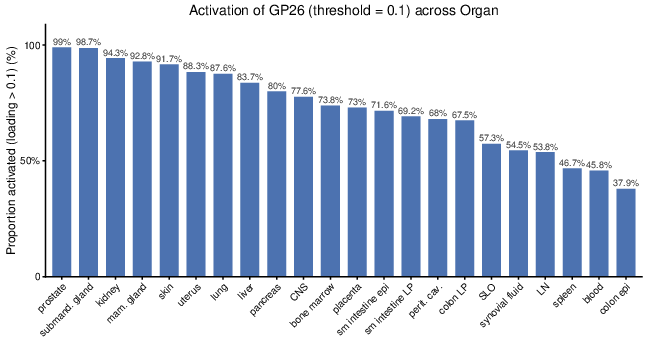
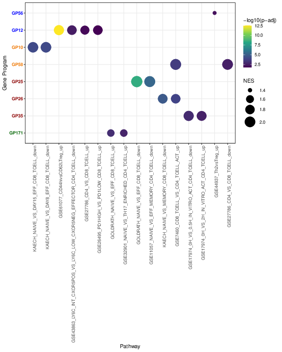
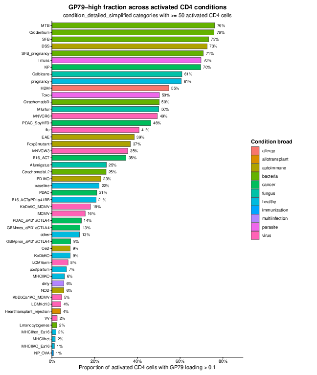
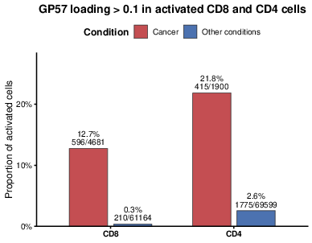

```{r doc-code, include=FALSE}
source("../code/R/doc_code.R")
```

Panels (b)-(f) are produced by
[`script/FigureS4.R`](https://github.com/AgueroZZ/immgenT-GP-analysis/blob/main/script/FigureS4.R),
which shares its curated GP set with [Figure 4](Figure4.html) via
`code/R/activation_shared_setup.R`. The code below is shown for
reference (not re-executed on this page); the images are its pre-rendered
output.

Panel (a) is not generated from code -- see below.

## Setup

```{r figs4-setup, code=code_for("../script/FigureS4.R", c("^", "Load data")), eval=FALSE}
```

## (a) Definition of resting and activated CD4/CD8 cells {#figs4a}

This panel shows the CITE-seq gating used to define resting and activated
cells; it is not generated from code, so only its caption is given here.

::: {.figcaption}
**Extended Data Fig. 4a.** Definition of resting and activated CD4+ and CD8+ T
cells. Activated CD44⁺CD62L⁻ (top) and resting CD62L⁺CD44⁻ (bottom) cells are
highlighted in each lineage-specific MDE. Gated cells are shown in the
adjacent CD62L versus CD44 protein-expression plot (CITE-seq, log-normalized
counts).
:::

The `annotation_level2_group` "activated"/"resting" labels that every other panel
on this page (and all of [Figure 4](Figure4.html)) filters on are the labels this
panel defines, so the gate itself is already in use here -- only the figure
illustrating it is absent.

## (b) GP26+ rate by organ {#figs4b}

```{r figs4b-code, code=code_for("../script/FigureS4.R", "s4b"), eval=FALSE}
```

```{r figs4b-img, echo=FALSE, out.width="32%"}

```

::: {.figcaption}
**Extended Data Fig. 4b.** Bar plot showing broad GP26 activity in activated
CD4+ and CD8+ T cells across organs (percent of cells with GP26 activity above
0.1 per tissue)
:::

## (c) GSEA dot plot {#figs4c}

```{r figs4c-code, code=code_for("../script/FigureS4.R", "s4c"), eval=FALSE}
```

```{r figs4c-img, echo=FALSE, out.width="32%"}

```

::: {.figcaption}
**Extended Data Fig. 4c.** Gene set enrichment analysis (GSEA) dot plot
relating activation-associated GPs to curated immunologic signature gene sets.
Color denotes −log10 adjusted *P* value, and dot size denotes the normalized
enrichment score (NES).
:::

## (d) GP79+ rate across conditions {#figs4d}

```{r figs4d-code, code=code_for("../script/FigureS4.R", "s4d"), eval=FALSE}
```

```{r figs4d-img, echo=FALSE, out.width="49%"}

```

::: {.figcaption}
**Extended Data Fig. 4d.** Bar plot showing the percentage of GP79-active
cells among all activated CD4+ T cells across immunological challenges.
:::

## (e) Per-cell log2FC heatmap {#figs4e}

```{r figs4e-code, code=code_for("../script/FigureS4.R", "s4e"), eval=FALSE}
```

```{r figs4e-img, echo=FALSE, out.width="100%"}
knitr::include_graphics("assets/FigureS4/s4e.png")
```

::: {.figcaption}
**Extended Data Fig. 4e.** Heatmap showing single-cell GP activity in
activated CD4+ and CD8+ T cells (log2 fold change in GP activity relative to
the resting baseline of the same lineage). Cells are grouped by cluster.
:::

## (f) GP57+ rate, cancer vs. other conditions {#figs4f}

```{r figs4f-code, code=code_for("../script/FigureS4.R", "s4f"), eval=FALSE}
```

```{r figs4f-img, echo=FALSE, out.width="49%"}

```

::: {.figcaption}
**Extended Data Fig. 4f.** Bar plot showing the percentage of GP57-active
cells among activated CD8+ and CD4+ T cells in cancer versus all other
conditions.
:::
