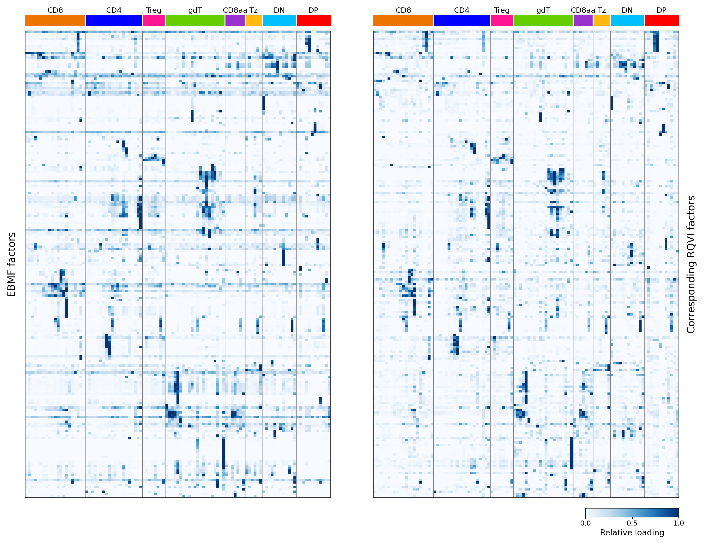

Figure S5 compares the cluster-level activity of the 200 EBMF gene programs (our
flashier fit) with 200 matched RQVI programs from our collaborator (Tianze,
[TianzeCompbio/RQVI_GP_figures](https://github.com/TianzeCompbio/RQVI_GP_figures)).
It is produced by
[`script/FigureS5.R`](https://github.com/AgueroZZ/immgenT-GP-analysis/blob/main/script/FigureS5.R),
[`script/FigureS5_rematch.py`](https://github.com/AgueroZZ/immgenT-GP-analysis/blob/main/script/FigureS5_rematch.py),
and
[`script/FigureS5_plot.py`](https://github.com/AgueroZZ/immgenT-GP-analysis/blob/main/script/FigureS5_plot.py),
in the collaborator's plotting style: two white-to-blue heatmaps sharing row and
column order, per-factor relative loading on `[0, 1]`, broad lineage annotations
above the columns, and a single shared colorbar.

Cells are our `L_pm_filtered` cells (those that passed the iterative
total-loading filter), restricted to non-thymocytes (`annotation_level1 !=
"thymocyte"`, all conditions), intersected with the cells carrying RQVI loadings.
EBMF and RQVI loadings are averaged within `annotation_level2` on those common
cells, and each RQVI program is placed on the row of its paired EBMF factor. The
collaborator's EBMF factor `F_k` was verified equal to our flashier `GP_k` at the
cell level (Pearson r = 1.0 for all 200).

## Figure S5 {#figs5}

```{r figs5-img, echo=FALSE, out.width="100%"}

```

::: {.figcaption}
**Fig. S5. Cluster-level activity profiles of corresponding EBMF and RQVI
factors.** EBMF cell loadings (our flashier fit) and matched RQVI program loadings
were averaged within 107 fine-grained `annotation_level2` clusters, using all
non-thymocyte cells present in both the filtered EBMF loading matrix and the RQVI
analysis (n = 629,551 cells). The left heatmap shows 200 EBMF factors ordered by
hierarchical clustering of their cluster-level profiles. The right heatmap shows,
on the same row and column order, the RQVI program assigned to each EBMF factor by
a global one-to-one maximum-correlation assignment over all 2,560 candidates
(10 seeds x 256 programs), re-derived on this clustering using all common cells.
Loadings were independently rescaled to `[0, 1]` within each factor for display;
broad lineage annotations are shown above the columns. The median per-factor
Pearson correlation across the displayed clusters was 0.766, and 92.5% of factors
had r >= 0.5. Standalone left/right panels and the shared colorbar are saved under
`figures/generated/Figure S5/S5_subfigures/`.
:::

## How the figure is made

Three steps, run from the repository root:

```bash
Rscript script/FigureS5.R          # cluster-mean matrices + column/palette metadata
python  script/FigureS5_rematch.py # one-to-one EBMF<->RQVI matching on our basis
python  script/FigureS5_plot.py    # Tianze-style heatmaps
```

The Python steps use an environment with `matplotlib`, `pandas`, `scipy`, `h5py`,
and `numpy`. The collaborator's cell-level loading package
(`data/rqvi_loading/RQVI_EBMF_heatmap_data_v1/`) provides the RQVI and EBMF
cell-level loadings; `data/` is a git-ignored symlink and is not tracked here.

### Cluster means

`script/FigureS5.R` builds the raw `annotation_level2` cluster-mean matrices for
the EBMF factors and the matched RQVI programs on the common non-thymocyte cells,
plus the column order (Figure-1 level1 lineage order, alphabetical within lineage)
and the lineage color palette.

```{r figs5-data, code=readLines("../script/FigureS5.R"), eval=FALSE}
```

### Matching

The matching is our collaborator's method applied unchanged to the re-aligned
data (only the inputs differ: our updated `annotation_level2` clustering and our
common cell set). Each factor's mean-loading profile is z-scored across clusters;
the signed Pearson correlation between every EBMF factor and all 2,560
seed-specific RQVI candidates (10 seeds x 256 programs) is `EBMF_z^T @ RQVI_z / K`;
candidates with a constant profile are excluded; and a maximum-weight one-to-one
assignment (`scipy.optimize.linear_sum_assignment`) pairs each EBMF factor with a
distinct RQVI candidate so that the total signed correlation is maximized. The
matching uses all common cells (`L_pm_filtered` intersect RQVI, 108 level2
clusters including the thymocyte cluster); the figure displays the 107
non-thymocyte clusters. Median per-factor r = 0.766, 92.5% >= 0.5. Full code:
[`script/FigureS5_rematch.py`](https://github.com/AgueroZZ/immgenT-GP-analysis/blob/main/script/FigureS5_rematch.py).

### Plotting

`script/FigureS5_plot.py` orders the EBMF rows by hierarchical clustering (average
linkage, correlation distance, optimal leaf ordering), rescales every factor to
`[0, 1]` across clusters, and draws the two heatmaps with a shared colorbar; the
matched RQVI panel reuses the EBMF row order. Full code:
[`script/FigureS5_plot.py`](https://github.com/AgueroZZ/immgenT-GP-analysis/blob/main/script/FigureS5_plot.py).
