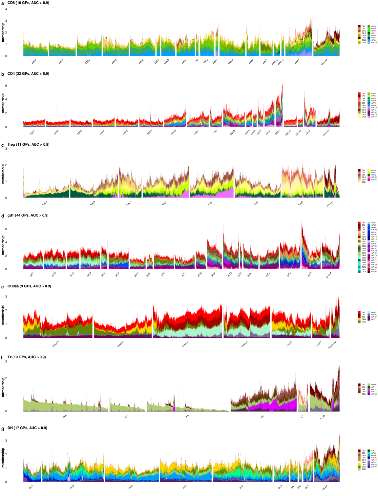

```{r doc-code, include=FALSE}
source("../code/R/doc_code.R")
```

This figure is one stacked panel -- seven wide rows, one per T cell lineage --
produced by
[`script/FigureS5.R`](https://github.com/AgueroZZ/immgenT-GP-analysis/blob/main/script/FigureS5.R),
which assembles the rows itself, so the figure on disk is always the one the
script last drew. It is the per-cluster, all-GP counterpart of
[Fig. 3b](Figure3.html#fig3b), which shows six hand-picked lineage-defining GPs
grouped by lineage: here every GP that marks a sub-lineage cluster is shown, and
cells are grouped by cluster within each lineage. The GPs are selected from the
cluster AUCs published as [Extended Data Table 6](ExtendedDataTable6.html), and
[`script/verify_structure_plot_gps.R`](https://github.com/AgueroZZ/immgenT-GP-analysis/blob/main/script/verify_structure_plot_gps.R)
re-derives every row's GP set from that published table, failing if it disagrees
with the figure or with the caption below. The code is shown for reference (not
re-executed on this page, since it loads the full cell-by-GP loading matrix);
the image is its pre-rendered output.

## Setup

```{r figs5-setup, code=code_for("../script/FigureS5.R", "doc:setup"), eval=FALSE}
```

## Row definitions and GP selection {#figs5-rows}

The row map, the AUC threshold, the display filters and the assembled geometry
live in `code/R/structure_plot_panels.R`, which the verification script reads as
well, so the figure and the check cannot disagree about what is shown:

```{r figs5-rows-code, code=code_for("../code/R/structure_plot_panels.R", "doc:panels"), eval=FALSE}
```

```{r figs5-selection-code, code=code_for("../script/FigureS5.R", "GP selection"), eval=FALSE}
```

## (a-g) Cluster-level GP membership by lineage {#figs5}

```{r figs5-code, code=code_for("../script/FigureS5.R", "s5:"), eval=FALSE}
```

```{r figs5-img, echo=FALSE, out.width="100%"}

```

::: {.figcaption}
**Extended Data Fig. 5a-g.** Structure plots showing single-cell GP activity
across major clusters of baseline non-thymocyte (a) CD8, (b) CD4, (c) Treg,
(d) gdT, (e) CD8aa, (f) Tz, and (g) DN cells, focusing on GPs with
cluster-specific AUC > 0.9.
:::

## Record of what the rows drew {#figs5-record}

The GP sets, the palette, and the clusters each row drew or omitted are written
out alongside the figure, which is what
[`script/verify_structure_plot_gps.R`](https://github.com/AgueroZZ/immgenT-GP-analysis/blob/main/script/verify_structure_plot_gps.R)
compares against [Extended Data Table 6](ExtendedDataTable6.html) and against
the caption above:

```{r figs5-record-code, code=code_for("../script/FigureS5.R", "What each panel drew"), eval=FALSE}
```
