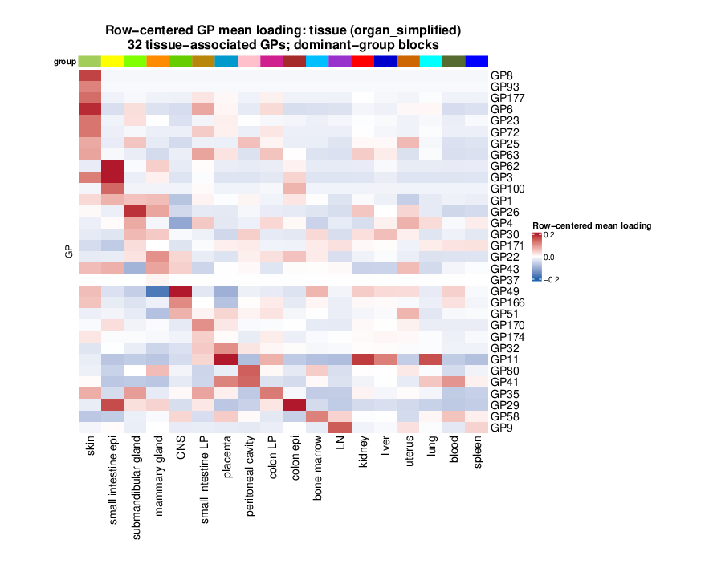
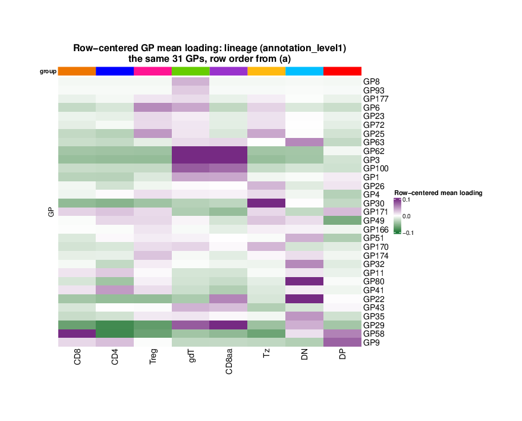

```{r doc-code, include=FALSE}
source("../code/R/doc_code.R")
```

Both panels are produced by
[`script/FigureS5.R`](https://github.com/AgueroZZ/immgenT-GP-analysis/blob/main/script/FigureS5.R).
They show the same 31 GPs -- the programs active across tissues -- first across
the 18 tissues and then across the 8 T cell lineages, so that a program's
tissue distribution can be read against its lineage distribution on the same
rows. The analysis uses healthy non-thymocyte cells (`condition_broad ==
"healthy"` and `annotation_level1 != "thymocyte"`). For each GP, its mean
loading across the groups shown is subtracted from every group mean, so a row
says where a program is more or less active than its own average rather than
how large its loading is. It is the tissue counterpart of
[Extended Data Figure 3](FigureS3.html), which shows all 200 GPs across the
level-2 clusters, and it puts the 31 programs behind
[Figure 5](Figure5.html)'s AUC analysis on a single pair of axes.

## Setup and the 31 tissue-active GPs

A GP is taken to be active across tissues when its *raw* (uncentered) mean
loading reaches 0.1 in at least one of the 18 tissues; 31 of the 200 GPs pass.
This is a threshold on activity, not on differential activity -- the panels
then show how that activity is distributed. The expected set is written out in
the script, so a change in the loadings, the cell filter or the cutoff fails
the run rather than quietly redrawing a different figure:

```{r figs5-setup, code=code_for("../script/FigureS5.R", c("^", "Setup:", "GP selection", "Ordering")), eval=FALSE}
```

## (a) Tissue mean loading {#figs5a}

```{r figs5a-code, code=code_for("../script/FigureS5.R", "s5a"), eval=FALSE}
```

```{r figs5a-img, echo=FALSE, out.width="100%"}

```

::: {.figcaption}
**Extended Data Fig. 5a.** Row-centered mean GP activity across 18 tissues,
for the 31 GPs active across tissues. Mean GP activity computed in samples at
baseline.
:::

## (b) Lineage mean loading {#figs5b}

```{r figs5b-code, code=code_for("../script/FigureS5.R", "s5b"), eval=FALSE}
```

```{r figs5b-img, echo=FALSE, out.width="70%"}

```

::: {.figcaption}
**Extended Data Fig. 5b.** The same 31 GPs across the 8 T cell lineages, in the
row order of (a). Mean GP activity computed in samples at baseline. Note the
different color scale: purple-green rather than blue-red, and -0.1 to 0.1
rather than -0.2 to 0.2, since spreading a program over 8 lineages instead of
18 tissues gives correspondingly smaller deviations.
:::

## What the panels drew

The 31 GPs, their dominant tissue and lineage, and their row position are
written out alongside the figure:

```{r figs5-record-code, code=code_for("../script/FigureS5.R", "What the panels drew"), eval=FALSE}
```
