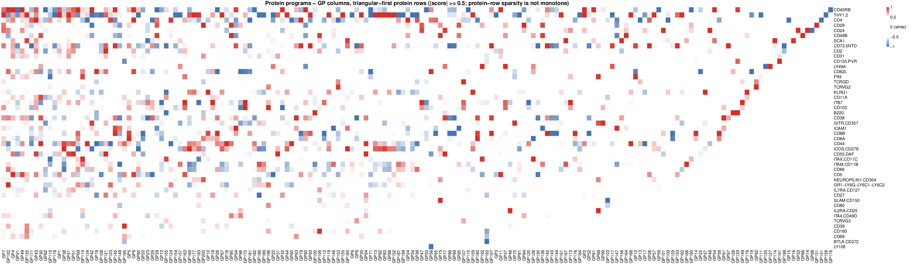

```{r doc-code, include=FALSE}
source("../code/R/doc_code.R")
```

This single-panel figure is produced by
[`script/FigureS6.R`](https://github.com/AgueroZZ/immgenT-GP-analysis/blob/main/script/FigureS6.R),
which shares its CITE-seq setup and protein filters with
[Figure 6](Figure6.html) and [Extended Data Figure 7](FigureS7.html) via
`code/R/citeseq_shared_setup.R`. The code below is shown for reference (not
re-executed on this page, since the shared setup takes about a minute to load);
the image is its pre-rendered output.

## Setup

```{r figs6-setup, code=code_for("../script/FigureS6.R", "doc:setup"), eval=FALSE}
```

## Protein-program heatmap {#figs6}

```{r figs6-code, code=code_for("../script/FigureS6.R", "s6"), eval=FALSE}
```

```{r figs6-img, echo=FALSE, out.width="100%"}

```

::: {.figcaption}
**Extended Data Fig. 6.** Heatmap of scaled protein scores for each GP (the re-estimated
protein matrix **U**), with the protein scores in each GP scaled so its maximum
|score| = 1. We focused on the **47 proteins** that performed best in the immgenT
CITE-seq dataset (isotype and low-quality proteins removed).
**Seventeen GPs lacked meaningful protein correlates** -- every protein score is
exactly zero -- and were omitted. Four putative contamination programs (GP40,
GP50, GP55 and GP188) were also removed, leaving **179 GPs**
(200 - 17 - 4 = 179); 47 proteins (rows) x 179 GPs (columns). Entries with an
absolute score below 0.5 are shown in white, with color running from blue (-1)
through white to red (+1). GP columns are ordered from the most to the fewest visible proteins. Protein rows are ordered by the position of their rightmost visible GP, placing proteins that extend into the sparse right side first and exposing a triangular support boundary; visible count and a rarity-weighted support score break ties. This triangular-first row order is not monotone in per-protein sparsity. GP labels are vertical and sized to the available heatmap-cell width; protein labels are sized to the available row height.
:::
