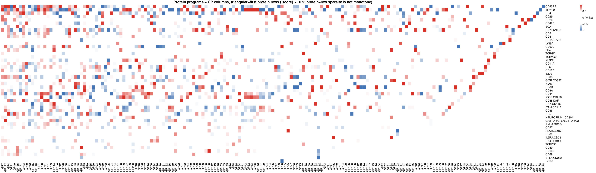

```{r doc-code, include=FALSE}
source("../code/R/doc_code.R")
```

This single-panel figure is produced by
[`script/FigureS7.R`](https://github.com/AgueroZZ/immgenT-GP-analysis/blob/main/script/FigureS7.R),
which shares its CITE-seq setup and protein filters with
[Figure 6](Figure6.html) and [Extended Data Figure 8](FigureS8.html) via
`code/R/citeseq_shared_setup.R`. The code below is shown for reference (not
re-executed on this page, since the shared setup takes about a minute to load);
the image is its pre-rendered output.

## Setup

```{r figs7-setup, code=code_for("../script/FigureS7.R", "doc:setup"), eval=FALSE}
```

## Protein-program heatmap {#figs7}

```{r figs7-code, code=code_for("../script/FigureS7.R", "s7"), eval=FALSE}
```

```{r figs7-img, echo=FALSE, out.width="100%"}

```

::: {.figcaption}
**Extended Data Fig. 7.** Heatmap of scaled protein scores for each GP. We
focused on the 47 proteins that performed best in the immgenT CITE-seq
dataset.
:::
